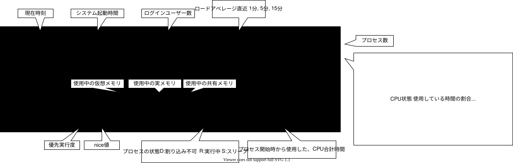

# キャパシティプランニング

## topコマンド

### オプション

| オプション             | 内容                                      |
| ---------------------- | ----------------------------------------- |
| -b                     | バッチモードで実行                        |
| -d <秒>                | 表示間隔(秒)を指定                        |
| -n <回数>              | 指定回数更新すると終了                    |
| -u <UID or ユーザー名> | 指定したUID(ユーザー名)のプロセスのみ監視 |
| -p <PID>               | 指定したPIDのプロセスのみ監視             |

### 表示内容


`[root@redhat8 ~]# top`


### topコマンド内での操作

ソート系

| キー         | 内容                           |
| ------------ | ------------------------------ |
| P            | CPU使用率順にソート            |
| M            | メモリ使用順にソート           |
| N            | プロセスID順にソート           |
| T            | プロセス起動時間順にソート     |
| < もしくは > | ソートする項目を順に切り替える |

その他

| キー        | 内容                               | 補足                                            |
| ----------- | ---------------------------------- | ----------------------------------------------- |
| Space/Enter | 表示を更新                         |                                                 |
| f           | 表示項目選択 別画面に移行する      | 別画面 移動: up/down, Space: 選択,  戻る: q/Esc |
| u           | 指定した UID or ユーザーのみ表示   | 実行後 UID or ユーザー を入力                   |
| k           | プロセスにシグナルを送信(killなど) | 実行後 PIDを入力 > シグナル(15など)を入力       |
| q           | topコマンド終了                    |                                                 |

[Linuxのtop コマンドの見方 ~メモリやload averageの単位,定義,目安~ | SEの道標](https://milestone-of-se.nesuke.com/sv-basic/linux-basic/top-command/)


## vmstat

- メモリおよび仮想メモリの詳細を監視。
- 最初の表示は起動時からの統計情報であることに注意

5秒ごとに4回実行
```text
[user@redhat8 ~]$ vmstat 5 4
procs -----------memory---------- ---swap-- -----io---- -system-- ------cpu-----
 r  b   swpd   free   buff  cache   si   so    bi    bo   in   cs us sy id wa st
 2  0   3096 246320   1900 1203460    0    0     0     2    4    2  0  0 99  0  0 ★ ここだけ起動時からの統計情報
 2  0   3096 246212   1900 1203460    0    0     0     0  105  204  0  0 99  0  0
 2  0   3096 246212   1900 1203460    0    0     0     0  102  195  0  0 99  0  0
 3  0   3096 246212   1900 1203460    0    0     0     0  104  200  0  0 99  0  0
[user@redhat8 ~]$
```

おまけ: 行頭に日時をつけて毎秒表示
```sh
vmstat 1 | awk '{ print strftime("%Y-%m-%d %H:%M:%S"), $0 }'
```


| 項目   | 列    | 内容                                                                             |
| ------ | ----- | -------------------------------------------------------------------------------- |
| proc   | r     | 実行待ちのプロセス                                                               |
|        | b     | 割り込み不可のスリープ状態にあるプロセスの数(I/O待ちなど) -> 0が望ましい         |
| memory | swpd  | 使用中のスワップサイズ(KB)                                                       |
|        | free  | 空き 物理メモリサイズ(KB)                                                        |
|        | buff  | バッファキャッシュのメモリサイズ(KB)                                             |
|        | cache | ページキャッシュのメモリサイズ(KB)                                               |
| swap   | si    | ディスクからスワップインされているメモリサイス(KB/s) -> swapから読み込んだデータ |
|        | so    | ディスクへスワップアウトされているメモリサイス(KB/s) -> swapへ書き込んだデータ   |
| io     | bi    | ブロックデバイスからの読み取りブロック数 (ブロック/s)                            |
|        | bo    | ブロックデバイスからの書き込みブロック数 (ブロック/s)                            |
| system | in    | 1sあたりの割り込み処理 -> 既存処理を一旦やめて、他の書影を実施した回数           |
|        | cs    | 1sあたりのコンテキストスイッチの回数 -> CPU並列処理のための切り替え回数          |
| cpu    | us    | ユーザープロセス がCPUを使用した時間の割合                                       |
|        | sy    | カーネル がCPUを使用した時間の割合                                               |
|        | id    | CPUがアイドル状態の時間の割合                                                    |
|        | wa    | ディスクI/O待ち時間の割合                                                        |
|        | st    | ゲストOSがCPUを割り当てられなかった時間の割合 (仮想環境のゲストマシンの際)       |


## iostat

- CPU使用状況 と ディスク入出力 を継続的に監視(おもにディスク)
- `yum isntall sysstat`

### オプション

| オプション    | 内容                                           |
| ------------- | ---------------------------------------------- |
| -c            | CPU使用率のみ                                  |
| -d            | デバイス使用率のみを出力                       |
| -k            | KB単位                                         |
| -m            | MB単位                                         |
| -x            | 拡張ディスク統計情報を出力                     |
| -p <デバイス> | 表示対象のデバイスを指定。`sysstat-p /dev/sda` |

### 実行例

```text
[user@redhat8 ~]$ iostat
Linux 4.18.0-372.26.1.el8_6.x86_64 (redhat8)    12/05/22        _x86_64_        (1 CPU)

avg-cpu:  %user   %nice %system %iowait  %steal   %idle
           0.27    0.04    0.40    0.07    0.00   99.22

Device             tps    kB_read/s    kB_wrtn/s    kB_read    kB_wrtn
sda               0.09         0.71         1.95     540049    1480450
scd0              0.00         0.00         0.00          1          0
dm-0              0.11         0.64         1.94     485930    1473214
dm-1              0.00         0.00         0.01       2260       5116

[user@redhat8 ~]$ 
```

## iotop

## sar

[システム動作データの自動収集 (sar)](https://docs.oracle.com/cd/E19253-01/819-0379/spconcepts-60676/index.html)

多機能。sysstatパッケージに含めれる。

`dnf install -y sysstat`

実務で使うのかは疑問

- システム状況を収集する `sadc` コマンド
- 収集データを表示する `sar` コマンド
- sadcのログを、整形して出力する `sadf` コマンド
- sadcコマンドを定期的に実行するためには`sa1`ファイルを編集
- sarコマンドを定期的に実行するために編集するスクリプト`sa2`


| コマンド    | 内容                                                                                                                                         |
| ----------- | -------------------------------------------------------------------------------------------------------------------------------------------- |
| sar -u      | CPU使用率を表示,                                                                                                                             |
| sar -P 番号 | 指定したCPUの使用率を表示,                                                                                                                   |
| sar -b      | ディスクI/Oの状況を表示                                                                                                                      |
| sar -r      | 物理メモリの使用状況を表示                                                                                                                   |
| sar -n DEV  | ネットワークインターフェースの正常な送信・受信パケットの情報を表示                                                                           |
| sadf        | sarで収集したデータを変換 -j: json, -x: xml, -H: ヘッダ情報表示 <br>-- をつけて、sarのオプションを渡す(-- -b -> ディスクI/Oの状況確認の結果) |
| nfsiostat   | NFSの入出力状況を表示                                                                                                                        |
| cifsiostat  | CIFSの入出力状況を表示                                                                                                                       |

## ps


VSS (Virtual Set Size)
RSS (Resident Set Size)
PSS (Proportional Set Size)
USS (Unique Set Size)

## netstat

```sh
netstat -i # インターフェイス 毎の情報
netstat -s # プロトコル 毎の情報
```

## uptime
- システム稼働時間, 現在のログインユーザー数, CPU平均不可 を表示
- topコマンドの1行目とほぼ同じ
```text
[root@redhat8 ~]# uptime
 02:14:42 up 8 days, 18:43,  1 user,  load average: 0.00, 0.00, 0.00
```

## lsof

ファイルを開いているプロセスを表示

rootユーザーで`vi /root/test.txt`しているとき、別にrootでログインし`lsof`してみた。   
- /rootディレクトリは掴まれている
- /root/test.txt 事態は掴んでいない
- /root/.test.txt.swp は掴まれている
```
[root@redhat8 ~]# lsof | grep -e '/root' -e 'COMMAND'
COMMAND     PID   TID TASKCMD             USER   FD      TYPE             DEVICE SIZE/OFF       NODE NAME
bash      62742                           root  cwd       DIR              253,0      184   16797825 /root
bash      62772                           root  cwd       DIR              253,0      184   16797825 /root
vi        62806                           root  cwd       DIR              253,0      184   16797825 /root
vi        62806                           root    6u      REG              253,0    12288   16797833 /root/.test.txt.swp
lsof      62833                           root  cwd       DIR              253,0      184   16797825 /root
grep      62834                           root  cwd       DIR              253,0      184   16797825 /root
lsof      62835                           root  cwd       DIR              253,0      184   16797825 /root
[root@redhat8 ~]# 
```


