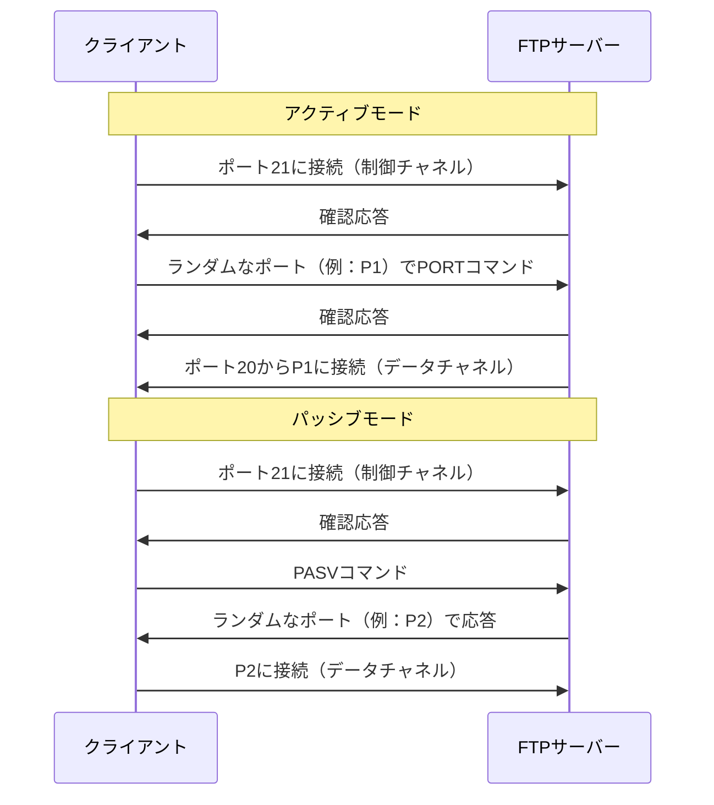

# FTP

ぶっちゃけ業務ではあまり使わないが、各試験でたびたび出題されるのでまとめ。
(sftpは使うけどね)

## 通信の仕組み

FTP（ファイル転送プロトコル）は主にアクティブモードとパッシブモードの2つのモードで動作します。

- **アクティブモード**: アクティブモードでは、クライアントがデータ通信用のランダムなポートを開き、その情報をサーバーに通知します。サーバーはそのポートに、自身のポート20から接続します。
- **パッシブモード**: パッシブモードでは、サーバーがランダムなポートを開き、その情報をクライアントに通知します。クライアントはそのポートに接続してデータ転送を行います。

ポートについて：
- FTPは、コマンド制御用にポート21を、アクティブモードでのデータ転送用にポート20を使用します。
- パッシブモードでは、データ転送用のポートはサーバーによって動的に割り当てられます。

