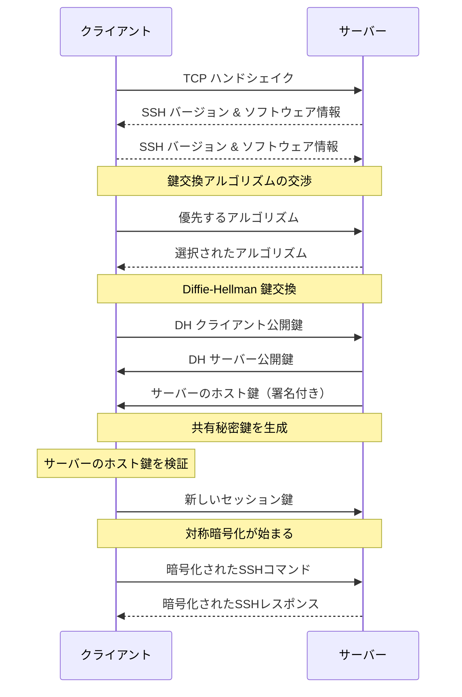

# SSH 設定系

```sh
ssh USER_NAME@HOST
  # -i 秘密鍵指定
  # -v デバッグモード
```
ちなみに、接続時に接続元の言語設定($LANG)を送っているみたい。

## 暗号鍵

### 暗号鍵 作成
```sh
# 鍵の作成(RSA暗号,4096バイト?) 
ssh-keygen -t rsa -b 4096

#  実行例：
#    [UserName@rhel ~]$ ssh-keygen -t rsa -b 4096
#    Generating public/private rsa key pair.
#    Enter file in which to save the key (/home/UserName/.ssh/id_rsa): # 作成先を聞かれる。EnterのみでもOK
#    Enter passphrase (empty for no passphrase):   # パスフレーズを聞かれる。不要ならEnter
#    Enter same passphrase again:                  # 再度パスフレーズを聞かれる
#    Your identification has been saved in /home/UserName/.ssh/id_rsa.
#    Your public key has been saved in /home/UserName/.ssh/id_rsa.pub.
#      :
#      :
#    [UserName@rhel ~]
#    [UserName@rhel ~]$ ls -l ~/.ssh/
#    合計 12
#    -rw-------. 1 UserName UserName 3369  m月 dd 00:00 id_rsa     # 作成された秘密鍵(以後 secret.key)
#    -rw-r--r--. 1 UserName UserName  736  m月 dd 00:00 id_rsa.pub # 作成された公開鍵(以後 public.key)
```

### 暗号鍵 登録 (接続先サーバの 対象ユーザに登録)

要は公開鍵を リモートの~/.ssh/authorized_keysに追記すればいいのだが、`ssh-copy-id`というコマンドがある。
```sh
# リモートへ公開鍵を転送する
ssh-copy-id -i secret.key ${USER}@${target_host}

  # -i なしの場合、~/.ssh/id_rsa.pub が使用される

# 接続テスト
ssh UserName@10.30.0.xxx -i secret.key

# memo
ssh-keygen -y -f secret.key > public.key  # 秘密鍵から公開鍵作成
ssh-keygen -l -f secret.key               # 鍵の強度確認
ssh-keygen -R 10.30.0.100                  # フィンガープリント削除
```

## セキュリティ系

### sshd_configでの制限

`/etc/ssh/sshd_config` の設定を変更する   

rootログインを禁止する場合
```
#PermitRootLogin yes
  ↓ 修正 ↓
PermitRootLogin no
```
パスワード認証を禁止する場合(鍵認証のみ)
```ini
#PasswordAuthentication yes
  ↓ 修正 ↓
PasswordAuthentication no
```
user01のみ許可する
```
AllowUsers user01
```

```sh
# 設定に問題がないかテスト(何も表示されなければOK)
sshd -t

# 更新
systemctl restart sshd
```

コピペ用
```sh
# 現在の設定を確認
grep -E 'PermitRootLogin|PasswordAuthentication|AllowUsers' /etc/ssh/sshd_config

# 設定の追加
echo "PermitRootLogin no" >> /etc/ssh/sshd_config
echo "PasswordAuthentication no" >> /etc/ssh/sshd_config

# 設定に問題がないかテスト(何も表示されなければOK)
sshd -t

# 更新
systemctl restart sshd
```


## known_hosts から削除
```
ssh-keygen -R   10.30.0.xxx
```

## sftp 設定

- sftp時のumask値設定

`/etc/ssh/sshd_config`で以下のように設定
```ini
# 以下で設定
Subsystem sftp /usr/libexec/openssh/sftp-server –u 002

# 特定ユーザーの場合は以下に記載
Match User user01,user02
        ForceCommand /usr/libexec/openssh/sftp-server -u 000
```


## ~/.ssh/config

- 接続先情報を登録可能

```sh
vi ~/.ssh/config

  # 記載例 ----------
  Host <任意のALIAS>
    HostName <IP_ADDRESS>
    User <USER_NAME>
    # Port ポート番号
    IdentityFile <秘密鍵のパス>
    # ServerAliveInterval 60
  # ----------

# 使い方
ssh <指定したALIAS>
```


## SSH ポートフォワード (踏み台)

```
ssh -L 8080:192.168.10.3:80 user@10.30.0.2

-f : バックグラウンドで動作
-N : コマンド実行無し

[ 操作端末 ]
  10.30.0.1
    |
  10.30.0.2
[ 踏み台SV ]
  192.168.10.2
    |
  192.168.10.3
[ 目的 webSV ]

```
参考までに、RDPは ポート3389
[sshポートフォワーディング - Qiita](https://qiita.com/mechamogera/items/b1bb9130273deb9426f5)


[sshキー(秘密鍵・公開鍵)の作成と認証　流れ - Qiita](https://qiita.com/soma_sekimoto/items/35845495bc565c38ae9d)


## WindowsにSSHアクセス

WindowsServer2019で確認   
OpenSSHをインストールすれば大丈夫。

[OpenSSH をインストールする | Microsoft Docs](https://docs.microsoft.com/ja-jp/windows-server/administration/openssh/openssh_install_firstuse)

流れは
1. OpenSSHインストール
2. OpenSSHサービス起動・自動起動有効化
3. FireWallの穴あけは不要 (インストール時点で空く)

ただし、クライアントから ssh-copy-id は出来なかった(少なくとも初期設定では)

### GUIの場合

設定 > アプリ > オプション機能の管理 > +機能の追加 > OpenSSHサーバー ⇒ インストール


### PowerShellの場合

```powershell
#  OpenSSH が使用可能か確認 (-Online とか書いてあるけどネット繋がってなくても成功)
Get-WindowsCapability -Online | Where-Object Name -like 'OpenSSH*'

    # 実行例
    # PS C:\Users\Administrator> Get-WindowsCapability -Online | Where-Object Name -like 'OpenSSH*'
    #
    # Name  : OpenSSH.Client~~~~0.0.1.0
    # State : Installed
    # 
    # Name  : OpenSSH.Server~~~~0.0.1.0
    # State : NotPresent

# Install the OpenSSH Server
Add-WindowsCapability -Online -Name OpenSSH.Server~~~~0.0.1.0

# Start the sshd service
Start-Service sshd

# Set 'Automatic' for the sshd StartupType
Set-Service -Name sshd -StartupType 'Automatic'
```

## sshd設定変更時 別穴を用意

[sshdの設定の安全なテスト方法](https://kaworu.jpn.org/kaworu/2008-10-19-1.php)

## 通信フロー

ChatGPTで生成。あっている？

