# Zabbix初期設定

- AlmaLinux8.x
- PostgreSQL 16

## 管理サーバ構築

概ね以下で大丈夫だが補足も含め記載

[Alma Linux 8、PostgreSQL、Apache用のZabbix 6.0 LTSをダウンロードしてインストールします](https://www.zabbix.com/download?zabbix=6.0&os_distribution=alma_linux&os_version=8&components=server_frontend_agent&db=pgsql&ws=apache)

```sh
# PostgreSQLが起動している必要がある

# 日本語パッケージインストール
dnf install langpacks-ja
dnf install -y glibc-locale-source

# リポジトリの追加
rpm -Uvh https://repo.zabbix.com/zabbix/6.0/rhel/8/x86_64/zabbix-release-6.0-4.el8.noarch.rpm
dnf clean all

# Zabbixサーバー、フロントエンド、エージェントをインストール
dnf install -y zabbix-server-pgsql zabbix-web-pgsql zabbix-apache-conf zabbix-sql-scripts zabbix-selinux-policy zabbix-agent
dnf install -y zabbix-web-japanese # 日本語化 任意


# Zabbix用のユーザーとDBを作成
sudo -u postgres createuser --pwprompt zabbix   # PWが聞かれるので応答 [*1]
sudo -u postgres createdb -O zabbix zabbix

# 初期スキーマとデータをインポート
zcat /usr/share/zabbix-sql-scripts/postgresql/server.sql.gz | sudo -u zabbix psql zabbix

# DBのパスワードを設定 *1で入れたもの
echo "P@ssw0rd" >> /etc/zabbix/zabbix_server.conf

# プロセス開始
systemctl restart zabbix-server zabbix-agent httpd php-fpm
systemctl enable zabbix-server zabbix-agent httpd php-fpm
```

http://hostname/zabbix にアクセスして初期設定を行う。

日本語を選択
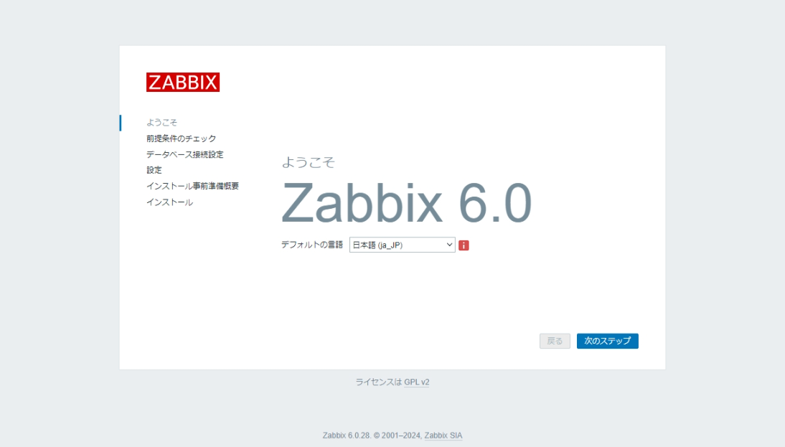

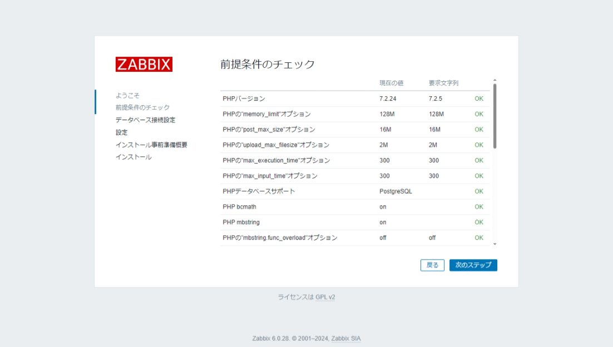

DBユーザー"zabbix"に設定したPWを入力  
今回は"データベースのTSL暗号化"のチェックを外した
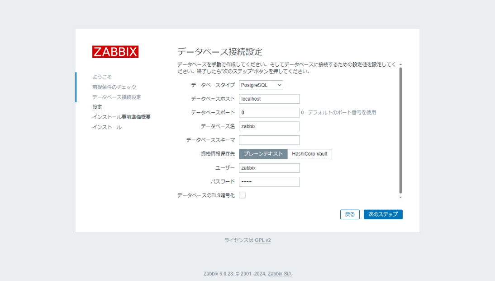

Zabbixサーバー名に任意の値を入力  
タイムゾーンをAsia/Tokyoに
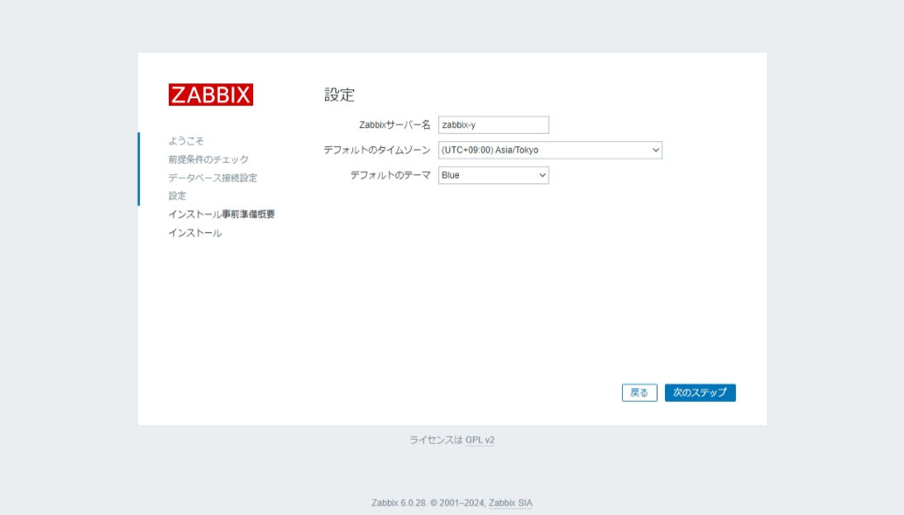

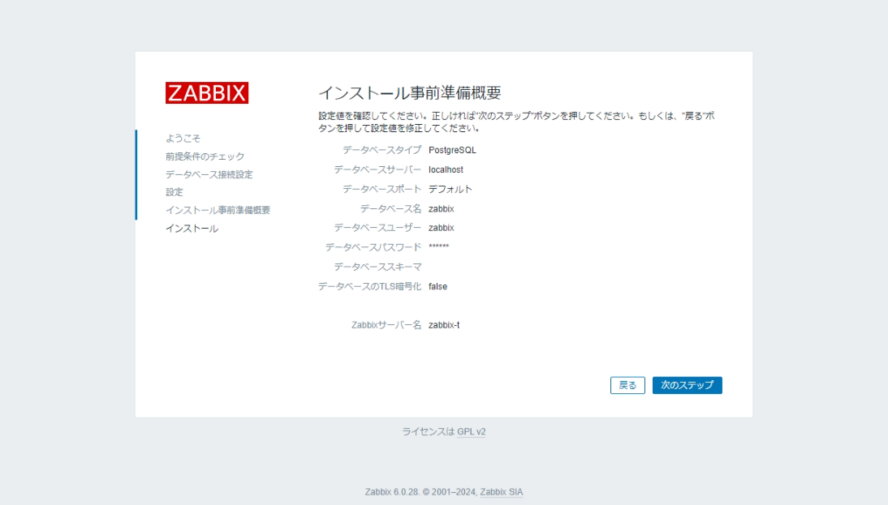

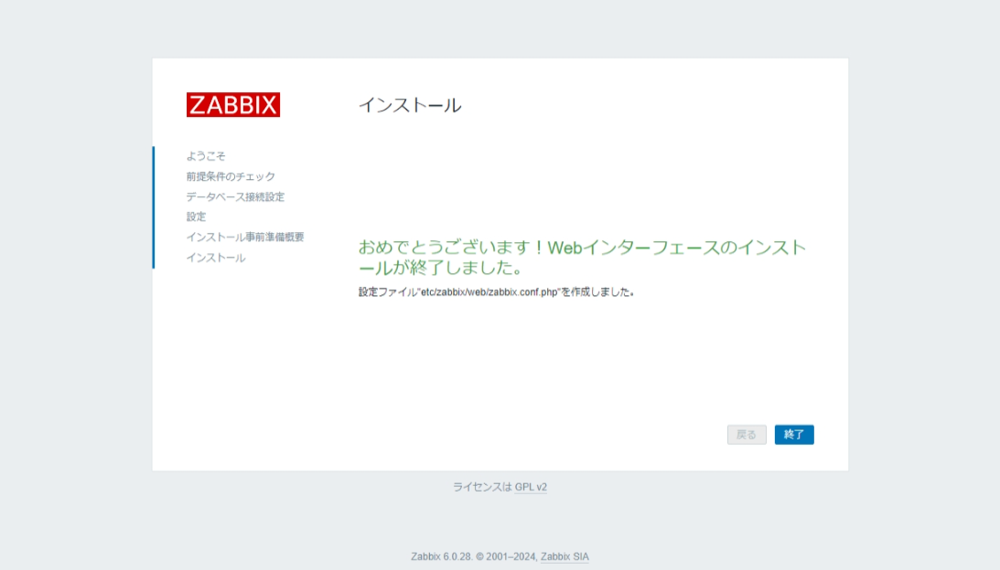

ログイン情報の初期値は、ユーザー名: Admin、パスワード: zabbix
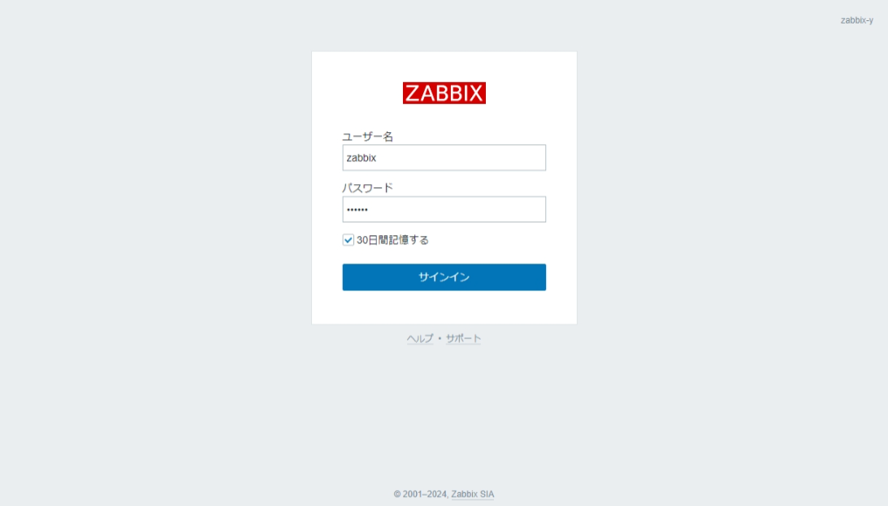

ログインできることが確認できた。
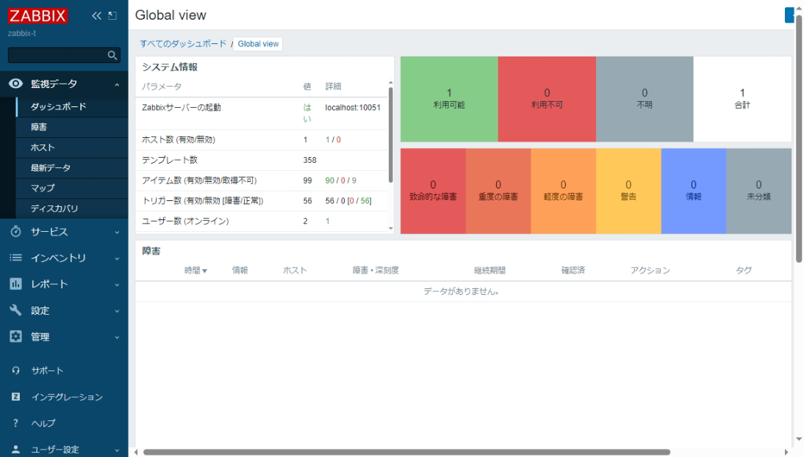


## 監視対象の自動登録設定

### 管理サーバの設定

設定 > アクション > 自動登録アクション をクリック
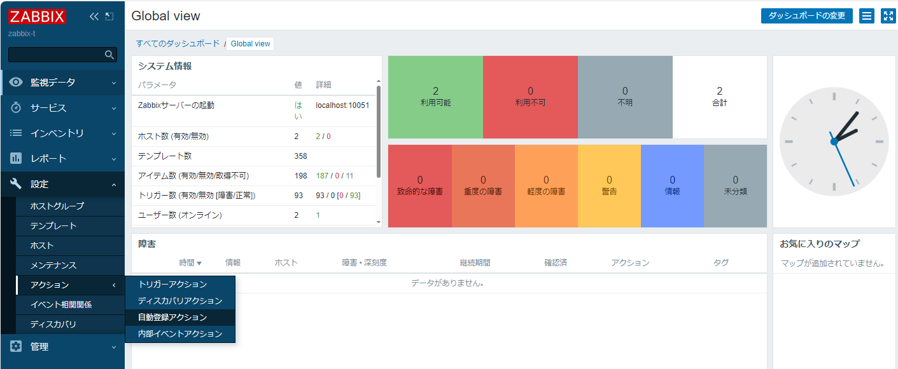

アクションの作成 をクリック
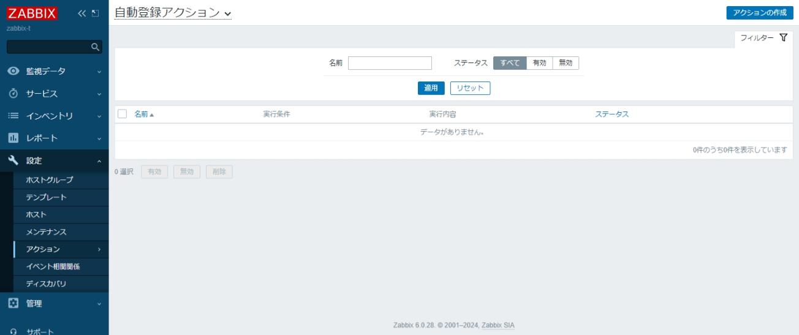

名前 に任意の値を入力し、実行条件で追加をクリック(今回は Auto Registration Linux)
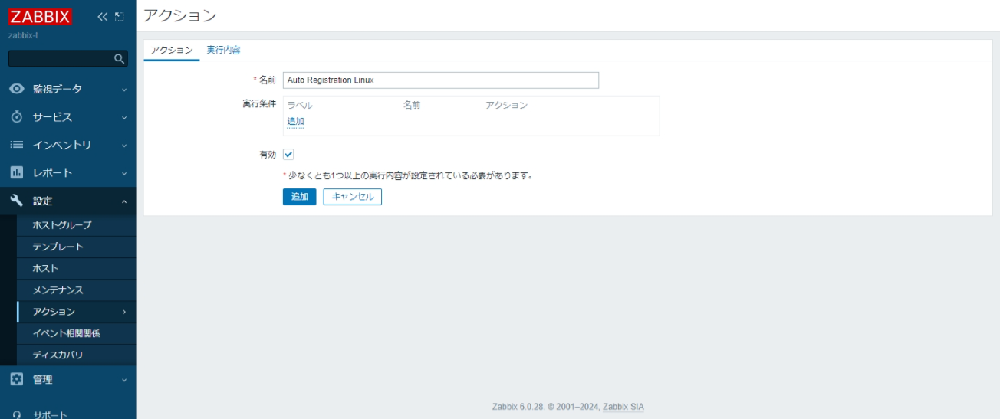

条件を入力する。今回はホストメタデータに「linux」が含まれる場合に登録する設定とする。入力後、追加をクリック。
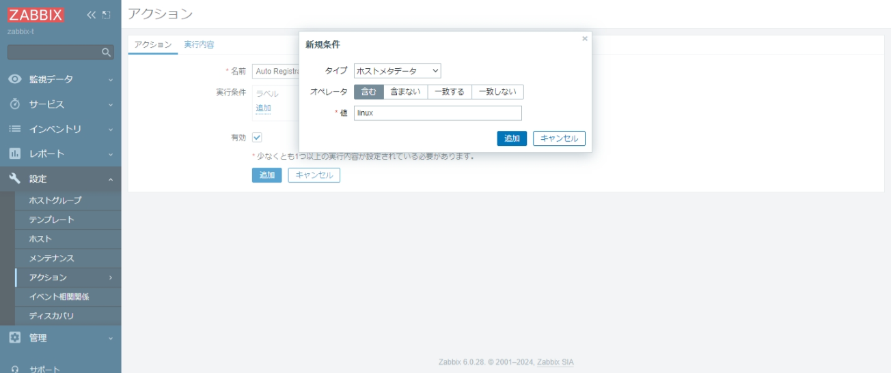

実行内容タブに移動したら、実行内容の 追加 ボタンから内容を追加できる。  
今回は2点追加  
1. ホストを追加
2. ホストグループに追加: Linux Servers
3. テンプレートとリンク: Linux by Zabbix Agent
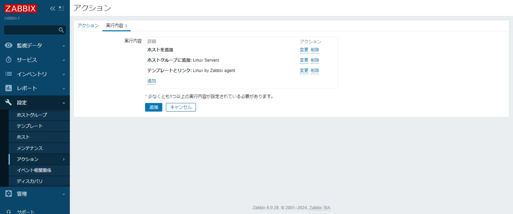

設定後は以下のような状態となる。  
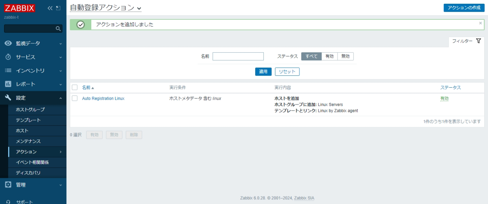

[さくらのクラウドで Zabbix を使いこなそう！～アクティブエージェントで簡単自動登録～ | さくらのナレッジ](https://knowledge.sakura.ad.jp/3592/)

### エージェント設定

以下の設定が必要

- Server=<管理サーバIP>
- ServerActive=<管理サーバIP>
- HostMetadata=<アクション作成時に指定した値>

/etc/zabbix/zabbix_agent2.conf
```
Server=10.30.0.xx
ServerActive=10.30.0.xx
HostMetadata=linux
```

## エージェントインストール

概ね以下の通り

[Download Zabbix agents](https://www.zabbix.com/download_agents)


## 参考
