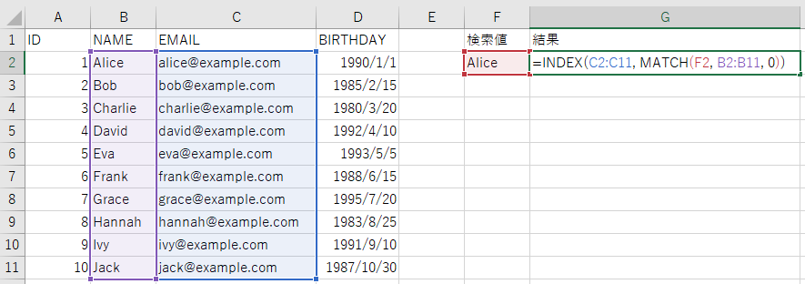
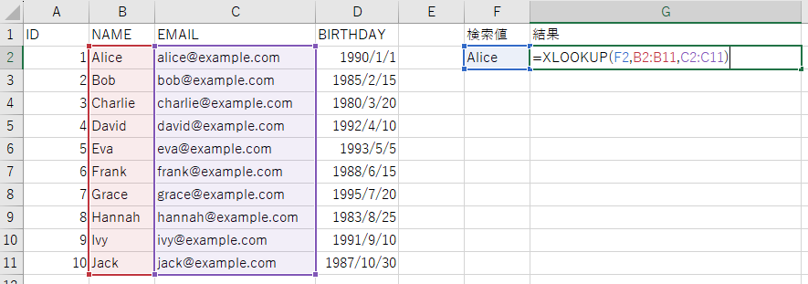

# Excel Tips

残念ながら逃れられないExcelのメモ

## ショートカット

| 説明     | ショートカット             |
| -------- | -------------------------- |
| 行を選択 | Shift + Space (半角入力時) |
| 行を削除 | Ctrl + "-"                 |
| 行を挿入 | Ctrl + Shift + "+"         |


## INDEX MATCH 関数

vlookup関数の代わり。左方向にも検索できる。     
xlookupもあようだが、使用できないエディションもあるみたいで微妙。

```
=INDEX(戻り値範囲, MATCH(検索値, 検索範囲, 0))
```




## XLOOKUP 関数

左方向にも検索できる。      
Microsoft 365でしか使用できなかったが、Excel2021で使用できるようになった?   

```
=XLOOKUP(検索値, 検索範囲, 戻り値範囲, [見つからない場合], [一致モード], [検索モード])  
```
[一致モード] はデフォルトで完全一致なので、省略してもOK




## フラッシュフィル

- ユーザーが入力したデータのパターンを認識し、そのパターンに基づいて自動的に残りのセルに値を補完してくれる機能。
- 入力パターンが曖昧な場合や、データに一貫性がない場合は正しく認識できないこともあるが、基本的には関数などを使用するより圧倒的に早い！

`Ctrl + E`


## Excelをcsvに変換

比較する場合などで。
ChatGPT作 未検証

```powershell
# Excel Interopアセンブリをロード
Add-Type -AssemblyName Microsoft.Office.Interop.Excel

# Excel COMオブジェクトを初期化
$excel = New-Object Microsoft.Office.Interop.Excel.Application

# ExcelのシートをCSVに変換する関数
function Convert-ExcelToCsv($filePath) {
    $workbook = $excel.Workbooks.Open($filePath)
    $folderName = [System.IO.Path]::GetFileNameWithoutExtension($filePath)
    New-Item -ItemType Directory -Force -Path ".\$folderName"

    foreach ($ws in $workbook.Sheets) {
        $csvPath = ".\$folderName\$($ws.Name).csv"
        $ws.SaveAs($csvPath, 6)  # 6はCSV形式に対応しています
    }

    $workbook.Close()
}

# Excelウィンドウを非表示にする
$excel.Visible = $false

# Excelファイルパスを引数として関数を呼び出す
Convert-ExcelToCsv $args[0]

# クリーンアップ
$excel.Quit()
```

## おまけ: 総務省ガイドライン

[総務省｜報道資料｜統計表における機械判読可能なデータの表記方法の統一ルールの策定](https://www.soumu.go.jp/menu_news/s-news/01toukatsu01_02000186.html)