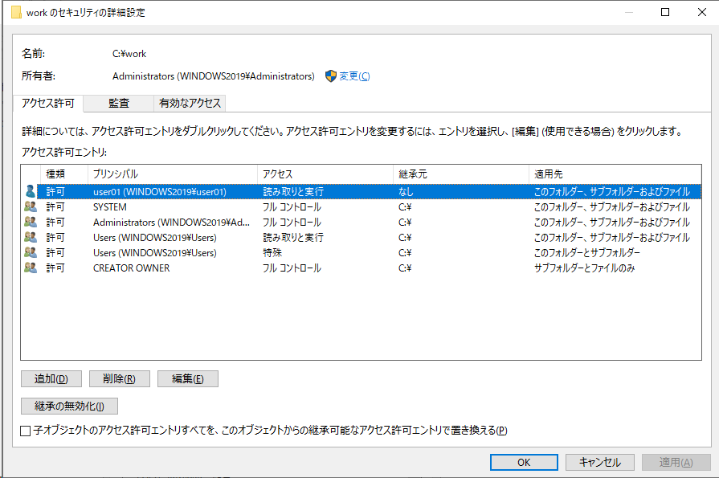

# Powershell コマンド集

WindowsServerの設定をPowershellで実行する場合のメモ


実行ログ採取
----------------------------------------

```powershell
# 実行ログの採取を開始 ファイルパスは C:\work\ホスト名_日時.log
Start-Transcript -Path $('C:\work\' + $(hostname) + '_' + $(Get-Date -Format yyyyMMdd_HHmmss )+ '.log')
# 実行ログの採取を停止
Stop-Transcript
```


ユーザー管理
----------------------------------------

### ローカルユーザー設定

```powershell
# ユーザー追加 
New-LocalUser -Name 'user01' -Password (ConvertTo-SecureString 'Password01' -AsPlainText -Force)

# ユーザー追加 - パスワードを無期限にする & ユーザーはパスワードを変更できない
New-LocalUser -Name 'user01' -Password (ConvertTo-SecureString 'Password01' -AsPlainText -Force) -PasswordNeverExpires -UserMayNotChangePassword

        # -PasswordNeverExpires     "パスワードを無期限にする" が有効
        # -UserMayNotChangePassword "ユーザーはパスワードを変更できない" が有効

Disable-LocalUser -Name 'user01'                # "アカウントを無効にする" を有効に
Enable-LocalUser -Name 'user01'                 # "アカウントを無効にする" を無効に

Get-LocalUser                                   # ユーザー一覧 確認
Get-LocalUser -Name 'user01' | Format-List      # user01 詳細表示
```
- [PowerShellでローカルユーザー(アカウント)やグループの追加・変更・削除を行う方法](https://www.haruru29.net/blog/how-to-configure-local-users-using-powershell/)


### ローカルグループ メンバー設定

```powershell
# グループにユーザーを追加
Add-LocalGroupMember -Group 'Administrators' -Member 'user01'
Add-LocalGroupMember -Group 'Administrators' -Member 'user01', 'user02'

# グループのメンバーを確認
Get-LocalGroupMember -Group 'Administrators'
```


フォルダ アクセス権
----------------------------------------

めっちゃ難しい。まぁGUIでも複雑だが。。     

```powershell
# フォルダのACLを取得
$acl = Get-acl <対象フォルダのパス>

# パーミッション設定 ※ 後述
$permission = (<ユーザーorグループ>,<アクセス許可の種類>,<継承フラグ>,<反映フラグ>,<Allow/Deny>)

    # ex) $permission = ("user01", "FullControl", "ContainerInherit, ObjectInherit", "None", "Allow")

# 適用するACLを作成
$rule = New-Object System.Security.AccessControl.FileSystemAccessRule $permission

# $acl を変更 > 適用
$acl.SetAccessRule($rule)
$acl | Set-Acl <対象フォルダのパス>

# 確認
(Get-acl <対象フォルダのパス>).access
```


### $permission に指定する内容

`$permission = (<ユーザーorグループ>,<アクセス許可の種類>,<継承フラグ>,<反映フラグ>,<Allow/Deny>)`

- ユーザーorグループ (IdentityReference)
    - GUIの **プリンシパル** で指定するもの。
    - 権限を設定したい ユーザー名 or グループ名 を指定。
    - `UserName`, `HostName\UserName` など
- アクセス許可の種類 (FileSystemRights)
    - GUIの **アクセス許可** で指定するもの。
    - 設定する値は、後述の設定表を参照。
- 継承フラグ (InheritanceFlags), 反映フラグ (PropagationFlags)
    - GUIの **適用先** で指定するもの相当。
    - 設定する値は、後述の設定表を参照。
- Allow/Deny (AccessControlType)
    - GUIの **種類** で指定するもの。(許可 or 拒否)
    - `Allow`, `Deny`

参考:

- [FileSystemAccessRule クラス (System.Security.AccessControl) | Microsoft Learn](https://learn.microsoft.com/ja-jp/dotnet/api/system.security.accesscontrol.filesystemaccessrule?view=net-6.0)
- [【PowerShell】フォルダーのアクセス権制御 – Cloud Steady | パーソルプロセス＆テクノロジー株式会社](https://cloudsteady.jp/post/24290/)


### アクセス許可 設定表

| GUIでの選択                    | アクセス許可の種類(FileSystemRights) |
| ------------------------------ | ------------------------------------ |
| フルコントロール               | FullControl                          |
| 読み取りと実行                 | ReadAndExecute                       |
| フォルダーの内容の一覧表示権限 | Traverse                             |
| 読み取り                       | Read                                 |
| 書き込み                       | Write                                |

※ Powershellで確認した際、`Synchronize` がついているときがあるが、自動付与される場合があるみたい。

> Synchronize   
> ファイル ハンドルが I/O 操作の完了に同期するまでアプリケーションが待機できるかどうかを指定します。    
> この値はアクセスを許可したときに自動的に設定され、アクセスを拒否したときには自動的に除外されます。

参考:   
[FileSystemRights 列挙型 (System.Security.AccessControl) | Microsoft Learn](https://learn.microsoft.com/ja-jp/dotnet/api/system.security.accesscontrol.filesystemrights?view=dotnet-plat-ext-3.1)


### 適用先 設定表

※ WindowsServer2019で実機検証

| GUIでの選択                                | 継承フラグ (InheritanceFlags)   | 反映フラグ (PropagationFlags) |
| ------------------------------------------ | ------------------------------- | ----------------------------- |
| このフォルダーのみ                         | None                            | None                          |
| このフォルダー、サブフォルダおよびファイル | ContainerInherit, ObjectInherit | None                          |
| このフォルダーとサブフォルダー             | ContainerInherit                | None                          |
| このフォルダーとファイル                   | ObjectInherit                   | None                          |
| サブフォルダーとファイルのみ               | ContainerInherit, ObjectInherit | InheritOnly                   |
| サブフォルダーのみ                         | ContainerInherit                | InheritOnly                   |
| ファイルのみ                               | ObjectInherit                   | InheritOnly                   |

参考(見てもよくわからないけど)

- [InheritanceFlags 列挙型 (System.Security.AccessControl) | Microsoft Learn](https://learn.microsoft.com/ja-jp/dotnet/api/system.security.accesscontrol.inheritanceflags?view=net-6.0)
- [PropagationFlags 列挙型 (System.Security.AccessControl) | Microsoft Learn](https://learn.microsoft.com/ja-jp/dotnet/api/system.security.accesscontrol.propagationflags?view=net-6.0)


### 実行例
- 対象は C:\work\
- user01 に以下の権限を付与
    - アクセス許可は 「読み取りと実行」
    - 適用先は 「このフォルダー、サブフォルダおよびファイル」

```text
PS C:\Users\Administrator> $acl = Get-Acl C:\work\
PS C:\Users\Administrator> $permission = ("user01", "ReadAndExecute", "ContainerInherit, ObjectInherit", "None", "Allow")
PS C:\Users\Administrator> $rule = New-Object System.Security.AccessControl.FileSystemAccessRule $permission
PS C:\Users\Administrator>
PS C:\Users\Administrator> $acl.SetAccessRule($rule)
PS C:\Users\Administrator> $acl | Set-Acl C:\work\
PS C:\Users\Administrator>
PS C:\Users\Administrator> (Get-Acl C:\work).access


FileSystemRights  : ReadAndExecute, Synchronize
AccessControlType : Allow
IdentityReference : WINDOWS2019\user01
IsInherited       : False
InheritanceFlags  : ContainerInherit, ObjectInherit
PropagationFlags  : None
...
```



役割と機能, サービス一覧を取得
----------------------------------------

```powershell
# 役割と機能の一覧 を取得
Get-WindowsFeature | Where-object {$_.Installed -eq $True}
# サービス一覧を取得
Get-Service| Select-Object status, starttype, name, displayname
```


IIS
----------------------------------------

### IPフィルタ設定
```powershell
# "Default Web Site/linux" に 10.30.0.0/24 の許可を設定
Add-WebConfiguration -Filter '/system.webServer/security/ipSecurity' -Location "Default Web Site/linux" -Value @{ipAddress="10.30.0.0";subnetMask="24";allowed="true"} 

# "Default Web Site/linux" に 192.168.10.0/24 の拒否を設定
Add-WebConfiguration -Filter '/system.webServer/security/ipSecurity' -Location "Default Web Site/linux" -Value @{ipAddress="192.168.10.0";subnetMask="24";allowed="false"} 

# "Default Web Site/linux" に デフォルト拒否を設定
Set-WebConfigurationProperty -Filter '/system.webServer/security/ipSecurity' -Location "Default Web Site/linux" -Name allowUnlisted -Value False

# 確認
(get-WebConfiguration -Filter '/system.webServer/security/ipSecurity' -Location "Default Web Site/linux").Collection
```


リモートアクセス
----------------------------------------

### 事前準備

Windows Remote Management 起動

TrustedHostsにアクセス先を追加
```powershell
# 確認
Get-Item WSMan:\localhost\Client\TrustedHosts

# 追加
Set-Item WSMan:\localhost\Client\TrustedHosts -Value <HostName>

# 確認
Get-Item WSMan:\localhost\Client\TrustedHosts

# 補足: 削除する場合 これでは上手くいかない。正解は？？
# Remove-Item WSMan:\localhost\Client\TrustedHosts -Value <HostName>
```

### 接続方法

```powershell
Enter-PSSession <HostName> -Credential <UserName>
```

Windows評価版 期間延長
----------------------------------------

```cmd
# 残り期間確認
slmgr /dli

# 残りのリセット回数確認
slmgr /dlv

# 期間延長
slmgr /rearm 
```

タスクスケジューラ
----------------------------------------

```ps1
# すべてのスケジュールされたタスクを取得し、それらが実行されるユーザーアカウントと共にその名前を表示する
Get-ScheduledTask | Select-Object TaskName, @{Name='RunAsUser'; Expression={$_.Principal.UserId}}
```