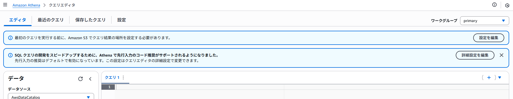

Athena
================================================================================

S3のデータ(csvなど)に対してSQLを発行できる

[Amazon Athena とは - Amazon Athena](https://docs.aws.amazon.com/ja_jp/athena/latest/ug/what-is.html)


基本操作
--------------------------------------------------------------------------------

### S3に検索対象のCSVを準備

```
$ aws s3 ls s3://sample-bucket/test_csv/
2025-06-24 19:03:58        397 sample.csv
```

```text
ID,NAME,EMAIL,BIRTHDAY
1,Alice,alice@example.com,1990-01-01
2,Bob,bob@example.com,1985-02-15
3,Charlie,charlie@example.com,1980-03-20
    :
```

### クエリ結果の保存先設定

マネコンのAthena画面から、クエリエディタを開く  
初回は`最初のクエリを実行する前に、Amazon S3 でクエリ結果の場所を設定する必要があります。`と出るので、設定を編集を押下。



任意のS3バケットを指定し、保存する。

### DBの作成

デフォルトで"default"というデータベースがあるので今回はそれを使用。  
手動作成する場合は下記のように作成
```sql
CREATE DATABASE sample_db;
```

### テーブルの作成

サンプル
```sql
CREATE EXTERNAL TABLE sample_users (
  id        INT,
  name      STRING,
  email     STRING,
  birthday  TIMESTAMP
)
ROW FORMAT SERDE
  'org.apache.hadoop.hive.serde2.lazy.LazySimpleSerDe'
WITH SERDEPROPERTIES (
  "field.delim"        = ",",
  "serialization.format" = ",",
  "timestamp.formats"  = "yyyy-MM-dd"
)
LOCATION 's3://sample-bucket/test_csv/'
TBLPROPERTIES (
  "skip.header.line.count" = "1",
  "has_encrypted_data"     = "false"
);
```

| パラメータ             | 説明                                                                       |
| ---------------------- | -------------------------------------------------------------------------- |
| LOCATION               | 対象のcsvの格納場所を指定する。csv自体のパスではなく、ディレクトリを指定。 |
| skip.header.line.count | csvにヘッダがある場合に使用。スキップする行を指定する。                    |

### クエリの実行

```sql
SELECT * FROM sample_users;
SELECT * FROM sample_users WHERE birthday BETWEEN DATE '1990-01-01' AND DATE '1995-12-31';
```
