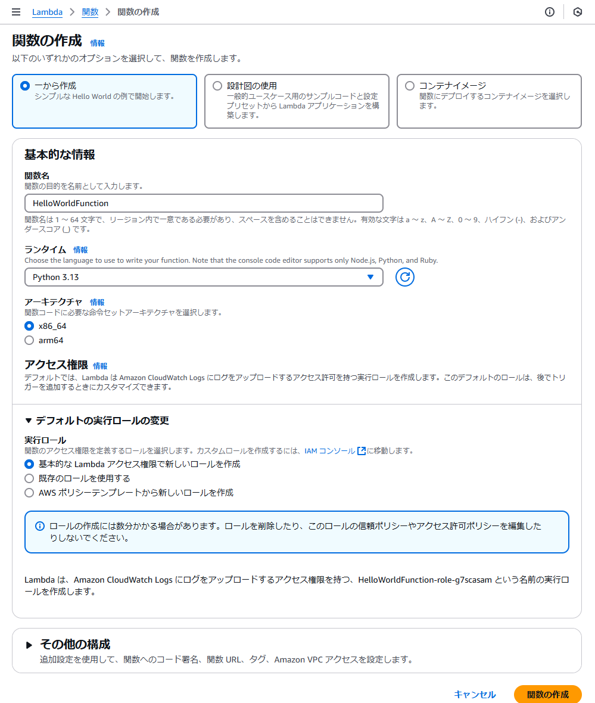
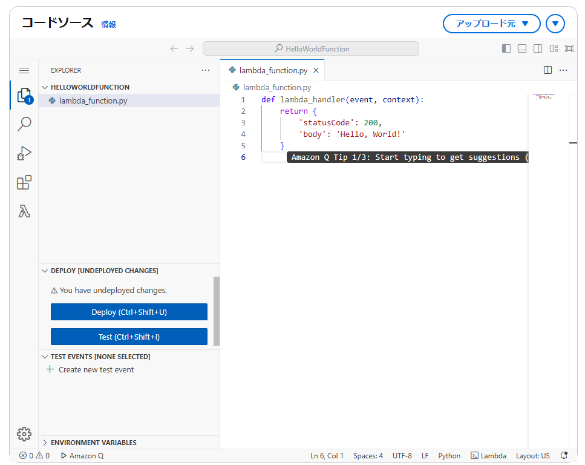
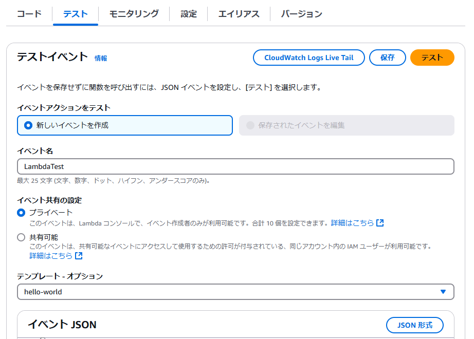
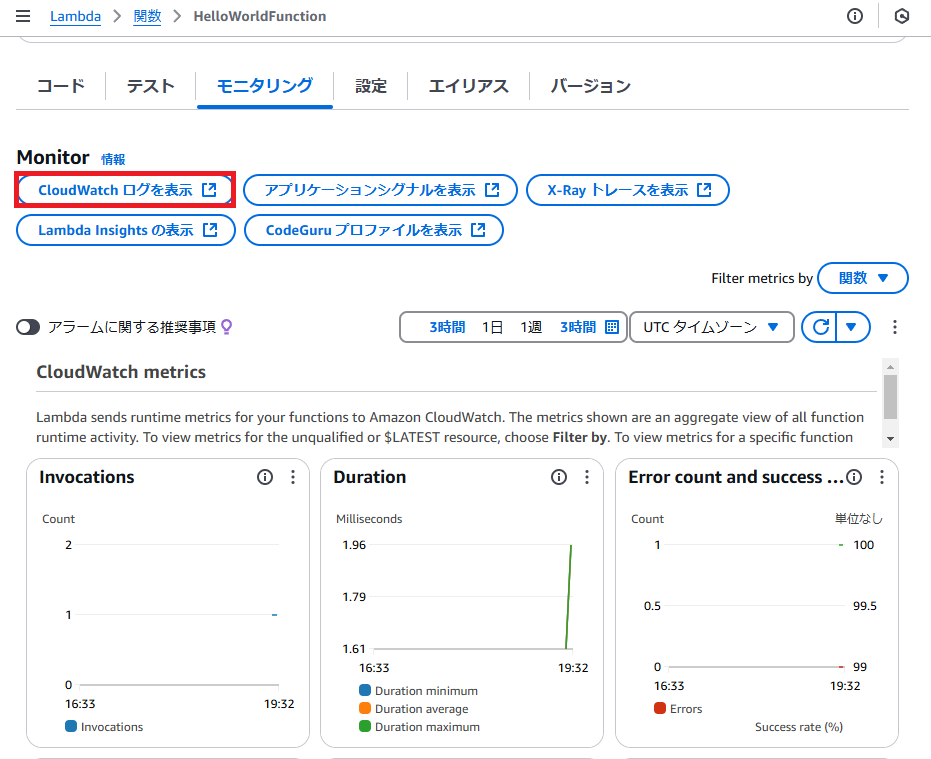
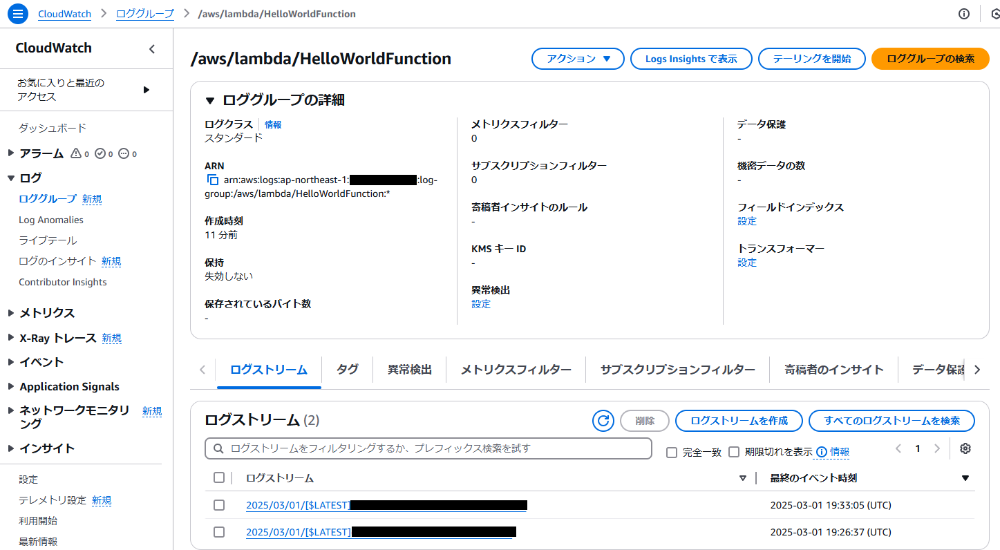

Lambda
================================================================================


基本操作
--------------------------------------------------------------------------------

### Lambda関数の作成

- "Lambda"サービスを検索
- 関数を作成 をクリック



関数の作成をクリックすると画面に遷移するので、コードを入力し、Deployをクリック。


```py
def lambda_handler(event, context):
    return {
        'statusCode': 200,
        'body': 'Hello, World!'
    }
```

### テスト実行



テストタブでテスト可能。



### ログの確認





