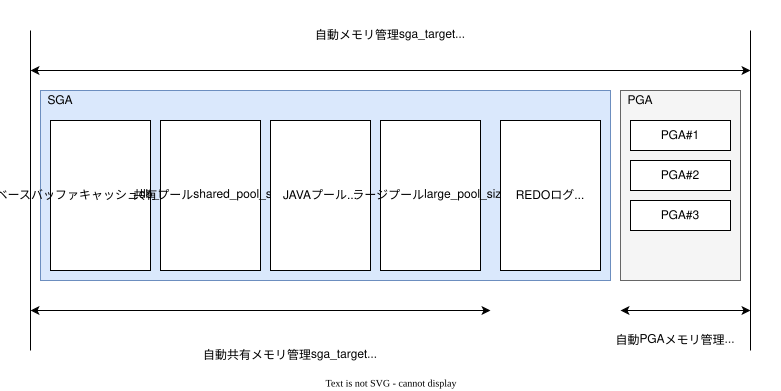

# Oracleメモリ管理

## 管理概要



|                      | 自動メモリ管理                     | 自動共有メモリ管理                | 自動PGAメモリ管理                 |
| -------------------- | ---------------------------------- | --------------------------------- | --------------------------------- |
| MEMORY_TARGET        | SGAとPGAの合計サイズを指定         | 0 or 未設定                       | 0 or 未設定                       |
| MEMORY_MAX_TARGET    | MEMORY_TARGETの上限値として機能    | 該当なし                          | 該当なし                          |
| SGA_TARGET           | 0以外の場合、SGA全体の下限値となる | SGAメモリの目標の合計サイズを指定 | 該当なし                          |
| SGA_MAX_SIZE         | 該当なし                           | SGAメモリの最大の合計サイズを指定 | 該当なし                          |
| PGA_AGGREGATE_TARGET | 該当なし                           | 該当なし                          | PGAメモリの目標の合計サイズを指定 |
| PGA_AGGREGATE_LIMIT  | 該当なし                           | 該当なし                          | PGAメモリの最大の合計サイズを指定 |

## 設定値確認

```sql
SHOW PARAMETER TARGET
```
実行例
```text
NAME                                 TYPE        VALUE
------------------------------------ ----------- ------------------------------
archive_lag_target                   integer     0
db_big_table_cache_percent_target    string      0
db_flashback_retention_target        integer     1440
fast_start_io_target                 integer     0
fast_start_mttr_target               integer     0
memory_max_target                    big integer 1488M
memory_target                        big integer 1488M
parallel_servers_target              integer     32
pga_aggregate_target                 big integer 0
sga_target                           big integer 0
target_pdbs                          integer     0
```

##

```sql
col name format a20
select name, to_char(value, '999,999,999,999') as mem
from v$parameter
where name in (
    'memory_target',
    'memory_max_target',
    'sga_target',
    'sga_max_size',
    'pga_aggregate_target',
    'pga_aggregate_limit',
    'log_buffer',
    'db_cache_size',
    'shared_pool_size',
    'java_pool_size',
    'large_pool_size'
);
```

```
show parameter target
alter system set memory_max_target=1488M scope=spfile;
alter system set memory_target=1488M scope=spfile;
shutdown immediate
startup
```
