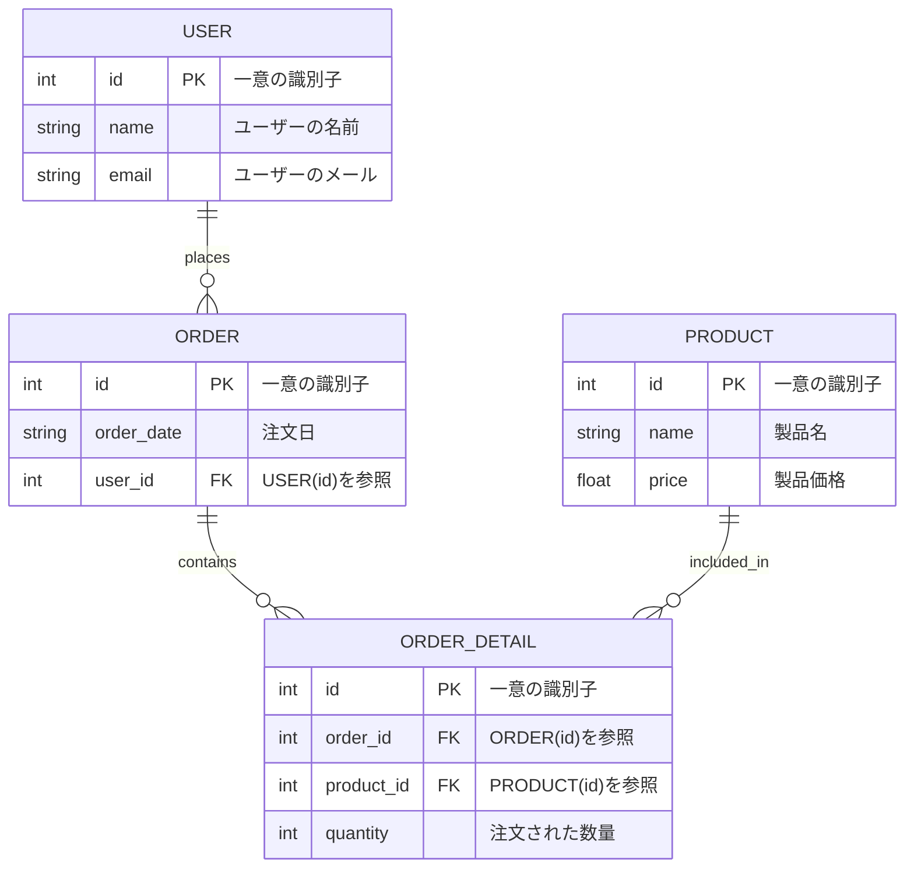
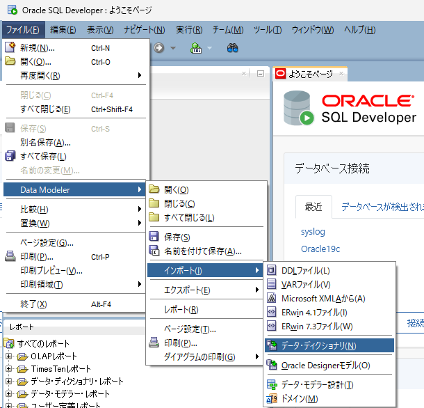
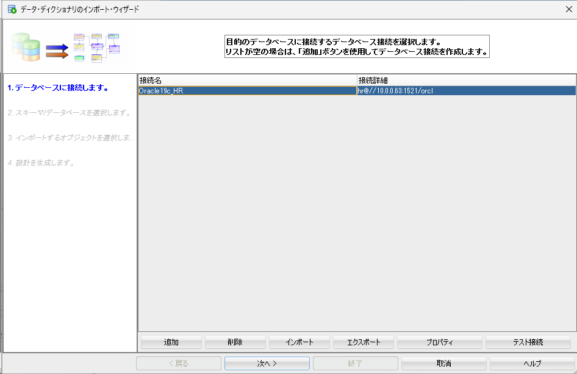
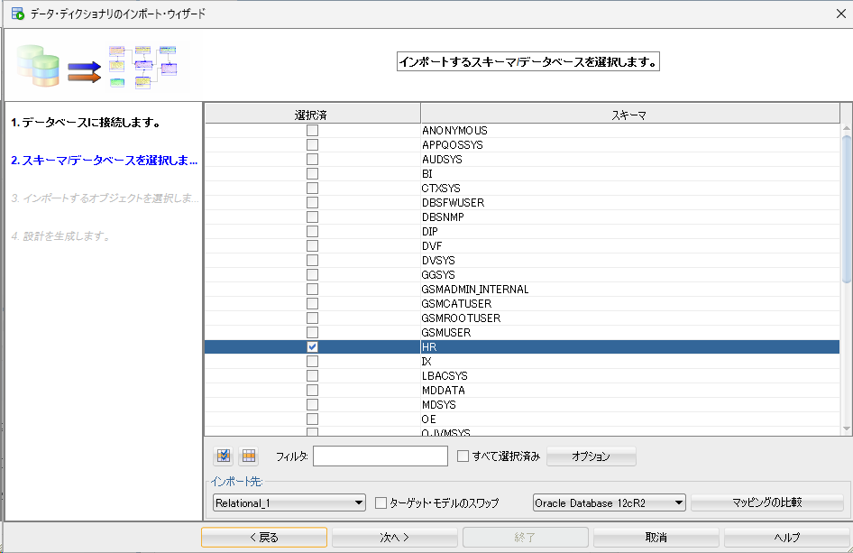
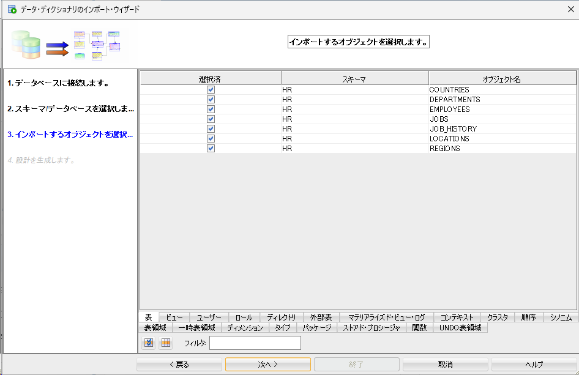
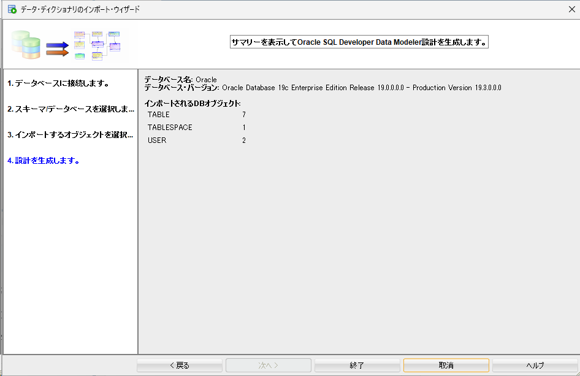
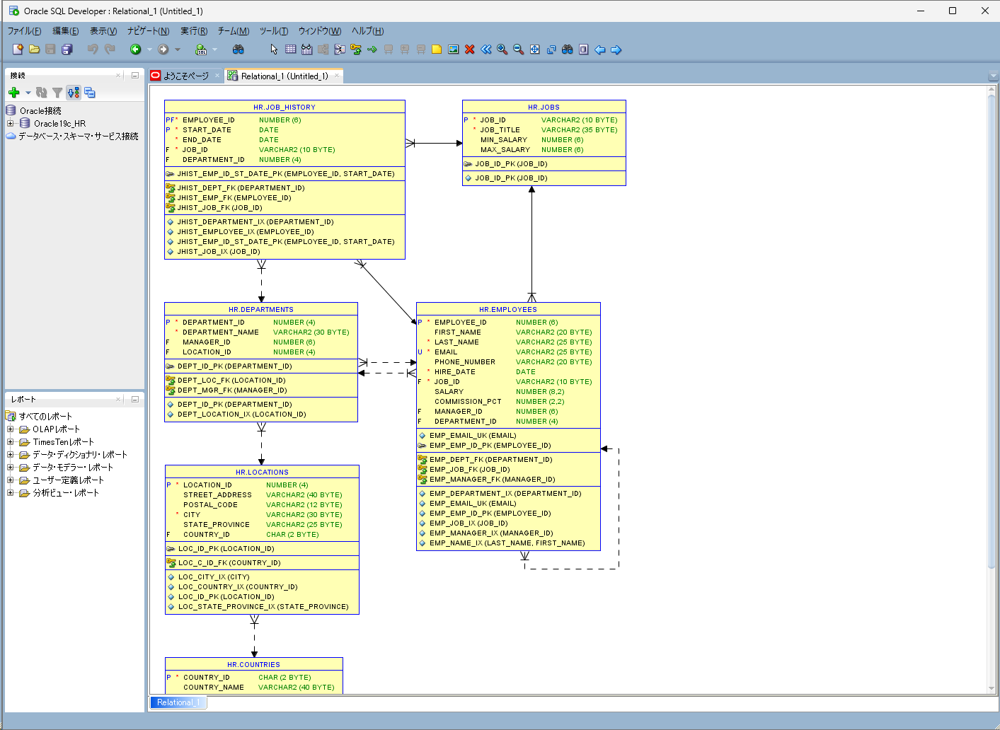

# ER図

Entity Relationship Diagram

### Mermaidでの書き方

ChatGPTに作成してもらったもの

```text
erDiagram
    USER {
        int id PK "一意の識別子"
        string name "ユーザーの名前"
        string email "ユーザーのメール"
    }
    ORDER {
        int id PK "一意の識別子"
        string order_date "注文日"
        int user_id FK "USER(id)を参照"
    }
    PRODUCT {
        int id PK "一意の識別子"
        string name "製品名"
        float price "製品価格"
    }
    ORDER_DETAIL {
        int id PK "一意の識別子"
        int order_id FK "ORDER(id)を参照"
        int product_id FK "PRODUCT(id)を参照"
        int quantity "注文された数量"
    }
    
    USER ||--o{ ORDER : places
    ORDER ||--o{ ORDER_DETAIL : contains
    PRODUCT ||--o{ ORDER_DETAIL : included_in
```



以下は、Marmaid図でER図を作成する際に使用できる、各種属性を表にしたものです。これらの属性を使ってER図を表現できます。

| 属性名    | 説明                                  |
| --------- | ------------------------------------- |
| `PK`      | プライマリキー (Primary Key)          |
| `FK`      | 外部キー (Foreign Key)                |
| `UQ`      | ユニークキー (Unique Key)             |
| `NN`      | NULL不可 (Not Null)                   |
| `AI`      | オートインクリメント (Auto Increment) |
| `default` | デフォルト値 (Default Value)          |
| `CHECK`   | 条件制約 (Check Constraint)           |
| `INDEX`   | インデックス                          |

これらの属性を使用して、Marmaid図でER図を作成すると、視覚的にデータベース構造を表現できます。

### Data Modeler(ER図作成)

サンプルスキーマのHRスキーマを出力する例

ファイル > Data Modeler > インポート > データディクショナリ をクリック  


接続先を選択し、次へをクリック  


HRスキーマを選択し、次へをクリック  


全て選択し、次へをクリック  


終了をクリック  


以下のように作成される  
