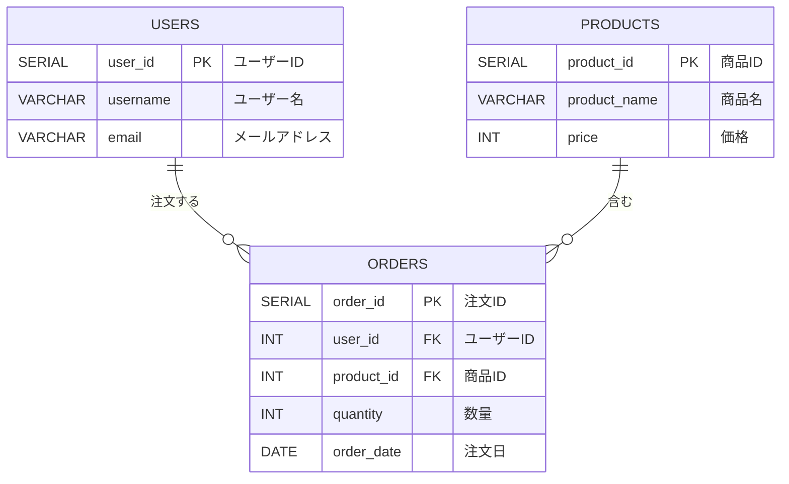

# データベーススペシャリストメモ


■ SQL
--------------------------------------------------------------------------------

インフラだから普段あまり使わなくて全然覚えられない(言い訳)


サンプルテーブル
--------------------------------------------------------------------------------




users表

| user_id | username | email               |
| ------- | -------- | ------------------- |
| 1       | Alice    | alice@example.com   |
| 2       | Bob      | bob@example.com     |
| 3       | Charlie  | charlie@example.com |
| 4       | David    | david@example.com   |

products表

| product_id | product_name | price |
| ---------- | ------------ | ----- |
| 1          | Notebook     | 300   |
| 2          | Pen          | 150   |
| 3          | Pencil       | 50    |
| 4          | Eraser       | 75    |
| 5          | Stapler      | 500   |
| 6          | Ruler        | 200   |

orders表

| order_id | user_id | product_id | quantity | order_date |
| -------- | ------- | ---------- | -------- | ---------- |
| 101      | 1       | 1          | 2        | 2024-09-01 |
| 102      | 1       | 2          | 5        | 2024-09-02 |
| 103      | 2       | 3          | 10       | 2024-09-03 |
| 104      | 2       | 4          | 4        | 2024-09-04 |
| 105      | 4       | 1          | 1        | 2024-09-07 |
| 106      | 4       | 2          | 2        | 2024-09-08 |


<details><summary>PostgreSQL用 SQL文</summary>

DDL  
```sql
-- ユーザー表
CREATE TABLE users (
    user_id SERIAL PRIMARY KEY,
    username VARCHAR(50),
    email VARCHAR(100)
);

-- 商品表（価格を整数で設定）
CREATE TABLE products (
    product_id SERIAL PRIMARY KEY,
    product_name VARCHAR(100),
    price INT
);

-- 注文表
CREATE TABLE orders (
    order_id SERIAL PRIMARY KEY,
    user_id INT REFERENCES users(user_id),
    product_id INT REFERENCES products(product_id),
    quantity INT,
    order_date DATE
);
```

DML
```sql
INSERT INTO users (user_id, username, email) VALUES
(1, 'Alice', 'alice@example.com'),
(2, 'Bob', 'bob@example.com'),
(3, 'Charlie', 'charlie@example.com'),
(4, 'David', 'david@example.com');

INSERT INTO products (product_id, product_name, price) VALUES
(1, 'Notebook', 300),   -- 価格を整数で設定
(2, 'Pen', 150),        -- 価格を整数で設定
(3, 'Pencil', 50),      -- 価格を整数で設定
(4, 'Eraser', 75),      -- 価格を整数で設定
(5, 'Stapler', 500),    -- 価格を整数で設定
(6, 'Ruler', 200);      -- 価格を整数で設定

INSERT INTO orders (order_id, user_id, product_id, quantity, order_date) VALUES
(101, 1, 1, 2, '2024-09-01'),  -- Aliceがノートを2冊注文
(102, 1, 2, 5, '2024-09-02'),  -- Aliceがペンを5本注文
(103, 2, 3, 10, '2024-09-03'), -- Bobが鉛筆を10本注文
(104, 2, 4, 4, '2024-09-04'),  -- Bobが消しゴムを4個注文
(105, 4, 1, 1, '2024-09-07'),  -- Davidがノートを1冊注文
(106, 4, 2, 2, '2024-09-08');  -- Davidがペンを2本注文
```

</details>


結合
--------------------------------------------------------------------------------

### 直積結合 (CROSS JOIN)

- 2テーブルのすべての組み合わせを表示。  
- xxxが一致している、とか関係ない。全組み合わせ出てくる。

```sql
SELECT u.user_id, u.username, o.order_id, o.order_date
FROM users u
CROSS JOIN orders o;
```

| user_id  | username | order_id | order_date |
| -------- | -------- | -------- | ---------- |
| 1        | Alice    | 101      | 2024-09-01 |
| 1        | Alice    | 102      | 2024-09-02 |
| 1        | Alice    | 103      | 2024-09-03 |
| 1        | Alice    | 104      | 2024-09-04 |
| 1        | Alice    | 105      | 2024-09-07 |
| 1        | Alice    | 106      | 2024-09-08 |
| 2        | Bob      | 101      | 2024-09-01 |
| (以下略) |          |          |            |


### 内部結合 (INNER JOIN) 

- INNER JOINでなく、JOINと書いてもいい
- `ON A.user_id = B.user_id` または `USING(ser_id)`のように結合条件を指定

### 外部結合 (OUTER JOIN) 

- 左側のテーブルから全てのレコードを取得し、
- 条件に一致する右側のテーブルのレコードを取得します。
- もし一致しない場合、右側のテーブルのカラムにはNULLが返されます。
- LEFT OUTER JOINでは、「左」はクエリ内で JOINキーワードの前に記述された 最初のテーブル を指します。「右」は、 JOINキーワードの後 にある 2番目のテーブル です。


```sql
SELECT u.user_id, u.username, o.order_id, o.order_date
FROM users u
LEFT OUTER JOIN orders o
ON u.user_id = o.user_id;
```

- この結果では、すべての顧客が表示されています。Charlieは注文がないため、右列結果がNULLです。

| user_id | username | order_id | order_date |
| ------- | -------- | -------- | ---------- |
| 1       | Alice    | 101      | 2024-09-01 |
| 1       | Alice    | 102      | 2024-09-02 |
| 2       | Bob      | 103      | 2024-09-03 |
| 2       | Bob      | 104      | 2024-09-04 |
| 3       | Charlie  | (NULL)   | (NULL)     |
| 4       | David    | 105      | 2024-09-07 |
| 4       | David    | 106      | 2024-09-08 |


上記は左外部結合の説明。他にもある。

- 左外部結合(LEFT OUTER JOIN) → 左にしかないものは右にNULL
- 右外部結合(RIGHT OUTER JOIN) → 右にしかないものは左にNULL
- 全外部結合(FULL OUTER JOIN) → 左にしかないものは右にNULL、逆も同じ


服問い合わせ
--------------------------------------------------------------------------------

### EXISTS

副問い合わせ結果があるかないかを確認。  
`NOT EXISTS`もある

```sql
SELECT * FROM users WHERE EXISTS (
   SELECT * FROM orders WHERE order_id = 0
)
```
→ 副問い合わせ部分が存在しないので、何も出ない

```sql
SELECT * FROM users WHERE EXISTS (
   SELECT * FROM orders WHERE order_id = 101
)
```
→ 副問い合わせ部分が存在するので、単に元のSQL `SELECT * FROM users`と同様の結果が実行される


### 相関問い合わせ

内側SQLで、外側SQLのテーブルを参照していたら、相関問い合わせ。1行ずつ処理

例1 EXISTS

```sql
SELECT * FROM users u WHERE EXISTS (
   SELECT * FROM orders WHERE user_id = u.user_id
)
```

| user_id | username | email             |
| ------- | -------- | ----------------- |
| 1       | Alice    | alice@example.com |
| 2       | Bob      | bob@example.com   |
| 4       | David    | david@example.com |

→ Charlieは orders にないので、表示されない

例2 IN

```sql
SELECT * FROM users u WHERE user_id IN (
   SELECT user_id FROM orders WHERE user_id = u.user_id
)
```

| user_id | username | email             |
| ------- | -------- | ----------------- |
| 1       | Alice    | alice@example.com |
| 2       | Bob      | bob@example.com   |
| 4       | David    | david@example.com |

→ Charlieは orders にないので、表示されない


## ■ DBMS

## ACID特性


| 特性                | 説明                                                                                                                       | 関連用語                   | 例                                                                                                                                             |
| ------------------- | -------------------------------------------------------------------------------------------------------------------------- | -------------------------- | ---------------------------------------------------------------------------------------------------------------------------------------------- |
| Atomicity(原子性)   | トランザクション内のすべての操作が成功するか、まったく行われないかのどちらかであること。                                   | トランザクション、コミット | 例えば、銀行の送金操作でお金が送金元から引き落とされるが、受取人に入金されなかった場合、引き落としも無効になる。                               |
| Consistency(一貫性) | トランザクションが終了するたびに、データベースが一貫した状態になることを保証する。                                         | 表の制約                   | 銀行口座の残高が負の値にならないという制約がある場合、トランザクションがそのルールを破らないことが保証される。                                 |
| Isolation(独立性)   | 同時に実行されているトランザクションが互いに影響を与えず、各トランザクションは他のトランザクションから独立して実行される。 | 別セッション               | 2つのユーザーが同時に同じ商品を購入しようとしても、在庫数は適切に管理され、1つのユーザーの購入が他のユーザーの購入に影響を与えないようになる。 |
| Durability(完全性)  | トランザクションが完了したら、その結果は障害やクラッシュが発生しても失われず、永続的に保持される。                         | バックアップ               | 送金が成功した場合、その後システム障害が起きても、送金の記録は失われずに保持される。                                                           |


## MVCC (多半同時実行制御)

MVCC（多版同時実行制御、Multi-Version Concurrency Control）は、データベースで同時に複数のトランザクションが実行される際に、データの一貫性を保ちながらロックを使わずに並行処理を可能にする手法。  
→ Oracleでは、commit前の元データがUNDOセグメントに退避されるやつ
トランザクション同士が互いに待機することなく、読み取り操作や書き込み操作ができるように。  


## ロック

| ロック種別     | 説明                                                                                                                                   | 例                                                                                                                         |
| -------------- | -------------------------------------------------------------------------------------------------------------------------------------- | -------------------------------------------------------------------------------------------------------------------------- |
| **共有ロック** | データの読み取りを許可するが、書き込み（変更）は許可しない。他のトランザクションも同じデータに対して共有ロックを取得できる。           | 複数のユーザーが同じレコードを読み取ることができるが、誰もそのレコードを変更することはできない。                           |
| **占有ロック** | データの読み取りおよび書き込み（変更）を独占する。他のトランザクションは同じデータに対してロックを取得できない（共有・占有どちらも）。 | ユーザーがレコードを更新する際、他のトランザクションはそのレコードを読み書きできず、変更が完了するまで待機する必要がある。 |


- 共有ロック: `LOCK TABLE xxx READ`
- `LOCK TABLE xxx WRITE`

## 直列化可能性

2相ロック

ロックは順に、アンロックは処理の最後にまとめて

## 待ちグラフ

## 側率製レベル


## ■ 設計

### 第一正規形～第三正規形のまとめ表

| 正規形               | 条件・特徴                                                                                   | 解決される問題                                         | 分解方法                                                                            |
| -------------------- | -------------------------------------------------------------------------------------------- | ------------------------------------------------------ | ----------------------------------------------------------------------------------- |
| **第一正規形 (1NF)** | - 繰り返し要素を持たない <br> - 各列が単一の値を持つこと                                     | 繰り返しグループや配列的なデータの排除                 | データを単一の値に分解する                                                          |
| **第二正規形 (2NF)** | - 第一正規形を満たしている <br> - 主キーの一部に依存する**部分関数従属**がない               | 複合主キーの一部に依存する部分関数従属性の排除         | 部分関数従属を持つ列を別のテーブルに分割 <br>（**情報無損失分解**を意識）           |
| **第三正規形 (3NF)** | - 第二正規形を満たしている <br> - 非キー属性が他の非キー属性に依存する**推移的従属性**がない | 非キー属性が他の非キー属性に依存する推移的従属性の排除 | 非キー属性同士の依存関係を排除し、別テーブルに分割 <br>（**情報無損失分解**を意識） |

### 用語の簡単な説明：
- **部分関数従属**：複合主キーの一部にのみ依存している属性が存在する状態。
- **完全関数従属**：すべての非キー属性が複合主キー全体に依存している状態。
- **情報無損失分解**：テーブルを分解しても、分解前の情報を完全に復元できる分解。

## 英単語

午後試験で描くケースがあるみたい。。  
変に心配したくないので念のため復習しておく。(あくまで念のためだし！)

- DEFAULT
- PRIMARY
- UNIQUE
- REFERENCES
- FOREIN
- TRANSACTION
