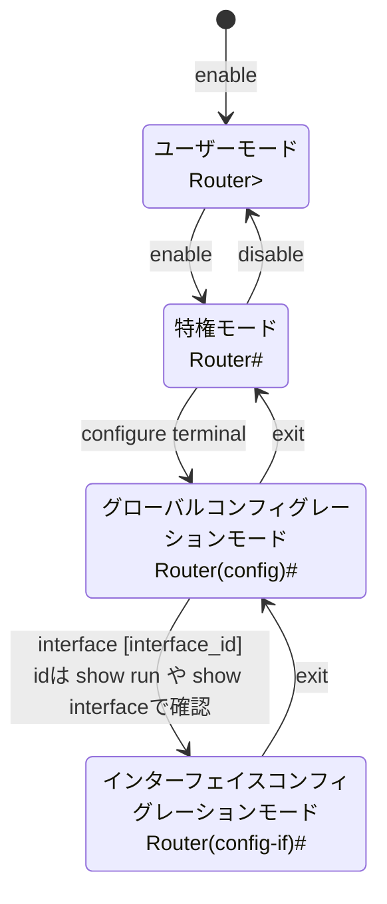

Cisco機器
========================================

確認: C841M-4X-JSEC/K9

## モードの種類 / 移動

```
■ ユーザーモード
Router>

↓ enable ↑ disable

■ 特権モード
Router#                    | ← end

↓ configure terminal ↑ exit

■ グローバルコンフィグレーションモード
Router(config)#

↓ interface <IF名>   ↑ exit  ※ IF名は show run や show interfaceで確認

■ インターフェイスコンフィギュレーションモード
Router(config-if)#
```




## 初期設定

### SSH 設定

```text
グローバルコンフィグレーション系
Router(config)# username xxx password xxx
Router(config)# hostname xxx
Router(config)# ip domain-name xxx.local    //なんでもいい
Router(config)# crypto key generate rsa     //RSA設定
    ※途中で暗号鍵サイズを聞かれるが、1024と入力 (512だとSSH ver1になる？)
Router(config)# enable secret xxxxx         //特権EXECモード移行時のパスワードを設定

SSH許可
Router(config)# line vty 0 4
Router(config-line)# transport input ssh    //SSH許可
Router(config-line)# login local
```

### IPアドレス設定

```
rt01(config)#interface GigabitEthernet 0/4
rt01(config-if)#ip address 192.168.10.253 255.255.255.0
rt01(config-if)#no shutdown
```

### 設定保存

```text
Router# copy running-config startup-config
```
※ CSR 1000V にシャットダウンコマンドはない模様。VMをパワーオフしてね。

CISCO C841M-4X-JSEC/K9

## 確認系

### IF概要確認

```
show ip interface brief
```

実行例:
```
l3sw#show ip interface brief
Interface                  IP-Address      OK? Method Status                Protocol
GigabitEthernet0/0         unassigned      YES unset  down                  down
GigabitEthernet0/1         unassigned      YES unset  down                  down
GigabitEthernet0/2         unassigned      YES unset  up                    up
GigabitEthernet0/3         unassigned      YES unset  up                    up
GigabitEthernet0/4         192.168.10.254   YES NVRAM  up                    up
GigabitEthernet0/5         unassigned      YES NVRAM  down                  down
Vlan1                      10.30.0.254      YES NVRAM  up                    up
NVI0                       192.168.10.254   YES unset  up                    up
```
※ 192.168.10.254 2個あるけどええんか？

### IF詳細確認

```
show interfaces [interface_id]
```

実行例
```
l3sw#show interfaces GigabitEthernet0/2
GigabitEthernet0/2 is up, line protocol is up
  Hardware is Gigabit Ethernet, address is 00fd.22e2.0202 (bia 00fd.22e2.0202)
  MTU 1500 bytes, BW 1000000 Kbit/sec, DLY 10 usec,
     reliability 255/255, txload 1/255, rxload 1/255
  Encapsulation ARPA, loopback not set
  Keepalive set (10 sec)
  Full-duplex, 1000Mb/s
  ARP type: ARPA, ARP Timeout 04:00:00
  Last input never, output never, output hang never
  Last clearing of "show interface" counters never
  Input queue: 0/75/0/0 (size/max/drops/flushes); Total output drops: 0
  Queueing strategy: fifo
  Output queue: 0/40 (size/max)
  5 minute input rate 2000 bits/sec, 5 packets/sec
  5 minute output rate 2000 bits/sec, 5 packets/sec
     84253902 packets input, 44638512594 bytes, 0 no buffer
     Received 410247 broadcasts (2451083 multicasts)
     0 runts, 0 giants, 0 throttles
     0 input errors, 0 CRC, 0 frame, 0 overrun, 0 ignored
     0 watchdog, 0 multicast, 0 pause input
     0 input packets with dribble condition detected
     150623934 packets output, 151682616563 bytes, 0 underruns
     0 output errors, 0 collisions, 2 interface resets
     0 unknown protocol drops
     0 babbles, 0 late collision, 0 deferred
     1 lost carrier, 0 no carrier, 0 pause output
     0 output buffer failures, 0 output buffers swapped out
```

## スタティックルート設定

構文: `ip route <dest_ipk> <mask> <gateway>`

```text
現在の設定を確認
Ruter# show ip route

デフォルトルートを追加
Ruter(config)# ip route 0.0.0.0 0.0.0.0 192.168.xxx.xxx

設定を削除(noをつける)
Ruter(config)# no ip route 10.80.0.0 255.255.255.0 10.30.0.129

設定を保存
Ruter# copy running-config startup-config
```

## ipマスカレード設定
```

show ip nat translations # 紐づけ確認

拡張ACL 100 を設定
    拒否 src：10.30.0.0 → dest：192.168.10.0
    許可 src：10.30.0.0

ip nat inside source list 100 interface GigabitEthernet 0/4 overload

clear ip nat translation
```

## ポートフォワード？静的 NAPT

```
(config)ip dns server
(config)ip domain lookup
(config)ip name-server 8.8.8.8
```

## ポートの状態確認

## ファームアップ

CISCO C841M-4X-JSEC/K9 のファームアップを行った際のメモ。
以下のURLから`c800m-universalk9-mz.SPA.155-3.M10.bin`をダウンロードし、USBに保存した物を使用する。

[Cisco Start ユーザ サイト - ファームウェア ダウンロード - Cisco](https://www.cisco.com/c/m/ja_jp/customer/cisco-start-user-site/download.html)

参考: 
- [はじめての Cisco C841M ルータ：ファームウェアアップデート - Qiita](https://qiita.com/clerk67/items/2b850966160c4d597d13)
- [Cisco 841M J ルータのIOSをアップデートしてみた | ワイズリマインダー](https://reminder.ysrock.com/2017/09/01/cisco-841m-j-%E3%83%AB%E3%83%BC%E3%82%BF%E3%81%AEios%E3%82%92%E3%82%A2%E3%83%83%E3%83%97%E3%83%87%E3%83%BC%E3%83%88%E3%81%97%E3%81%A6%E3%81%BF%E3%81%9F/)

USBからflashへファイルコピー
```
Directory of usbflash0:/

    5  -rw-    58969072  Sep 30 2019 19:40:40 +09:00  c800m-universalk9-mz.SPA.155-3.M10.bin

31282167808 bytes total (31223070720 bytes free)
Router#
Router#copy usbflash0: flash:
Source filename []? c800m-universalk9-mz.SPA.155-3.M10.bin
Destination filename [c800m-universalk9-mz.SPA.155-3.M10.bin]? 
Copy in progress...
    :
    :
58969072 bytes copied in 48.928 secs (1205221 bytes/sec)
```
ファイルの確認
```
Router#dir flash:
Directory of sdflash:/

    1  -rw-    59023172   Mar 7 2019 00:30:32 +09:00  c800m-universalk9-mz.SPA.155-3.M5.bin
    2  -rw-        3068   Mar 7 2019 00:39:24 +09:00  cpconfig-8xx.cfg
  407  -rw-    58969072  May 10 2022 00:42:58 +09:00  c800m-universalk9-mz.SPA.155-3.M10.bin
    3  drw-           0   Mar 7 2019 00:40:04 +09:00  ccpexp
  406  -rw-       22750   Mar 7 2019 00:43:16 +09:00  home.html

1950683136 bytes total (1823768576 bytes free)
```

ファイルが破損していないか確認
```
Router#verify  flash:c800m-universalk9-mz.SPA.155-3.M10.bin
Starting image verification
Hash Computation:    100% Done!
Computed Hash   SHA2: DF66EBAAA6B8C0DE51C52A0F2E431F07
                      D65B8F067538BE90ED0365F8EFB909F9
                      E73E41E308D120471F8DC191A58EF3D8
                      5F70E509242A20A96276C21CE1EBA0A4
                      
Embedded Hash   SHA2: DF66EBAAA6B8C0DE51C52A0F2E431F07
                      D65B8F067538BE90ED0365F8EFB909F9
                      E73E41E308D120471F8DC191A58EF3D8
                      5F70E509242A20A96276C21CE1EBA0A4
                      
CCO Hash        MD5 : 78DEE2CF88889A5D11EFC7310FFFE62D
Digital signature successfully verified in file sdflash:c800m-universalk9-mz.SPA.155-3.M10.bin
```
ファーム更新
```
Router#configure terminal 
Enter configuration commands, one per line.  End with CNTL/Z.
Router(config)#boot system flash:c800m-universalk9-mz.SPA.155-3.M10.bin
Router(config)#exit
Router#
```
設定を反映し再起動
```
Router#copy running-config startup-config
Destination filename [startup-config]? 
Building configuration...
[OK]
Router#reload
Proceed with reload? [confirm]
```
バージョン確認
```
Router#show version
Cisco IOS Software, C800M Software (C800M-UNIVERSALK9-M), Version 15.5(3)M10, RELEASE SOFTWARE (fc3)
Technical Support: http://www.cisco.com/techsupport
Copyright (c) 1986-2019 by Cisco Systems, Inc.
```

## 参考

[CLIを使用したCatalyst 1200および1300スイッチのDay Zero設定 - Cisco](https://www.cisco.com/c/ja_jp/support/docs/smb/switches/Catalyst-switches/kmgmt3582-day-zero-setup-catalyst-1200-1300-switches-using-cli.html)
