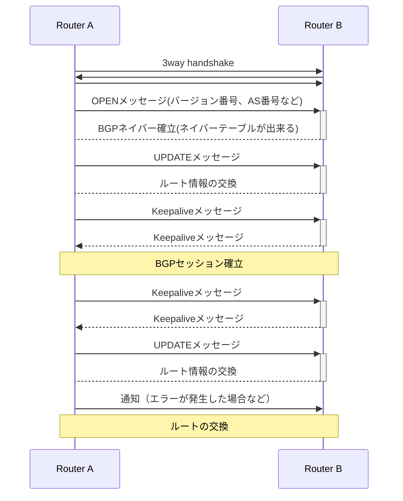
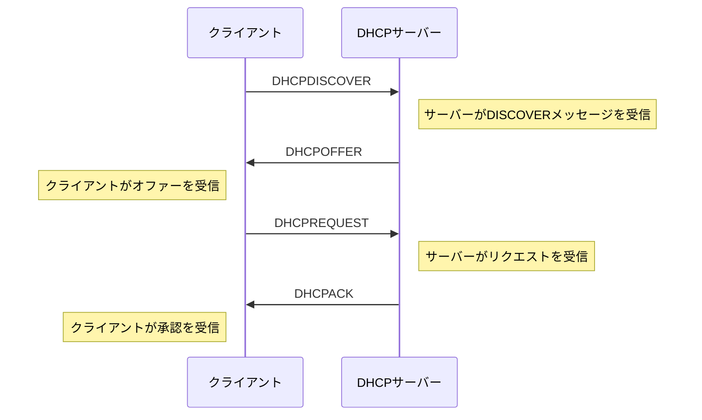
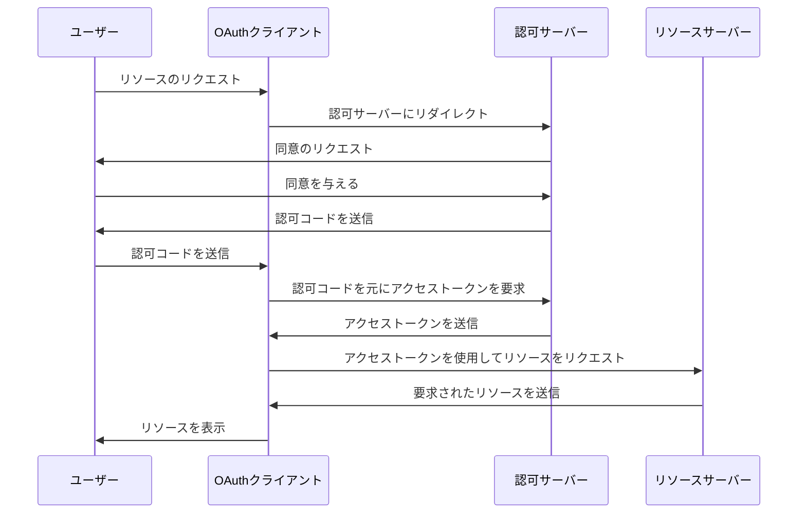

# ネスぺメモ

試験直前に見直す用

## BGP

Border Gateway Protocol

パスベクタ型

ISPなどの相互接続時にお互いの経路情報をやり取りするために使われる経路制御プロトコル



ネイバーはIPアドレスを指定

ルート情報のアドバタイズ(広告)

## AS（Autonomous System：自律システム）

AS（Autonomous System：自律システム）

グローバルAS番号

プライベートAS番号

- スタブASインターネットへの出口が1個 デフォルトルート設定)
- トランジットAS ISPはだいたいこれ 複数ASに接続しており中継する ルート情報の交換も よくある
- マルチホーム非トランジットAS 企業はだいたいこれ 複数のASに接続していても、自分のルート情報のみを公告する(=別ASの通信を中継させない)


## DNS

### SPF（Sender Policy Framework）

DNSのSPF（Sender Policy Framework）レコードは、ドメインに代わってメールを送信することが許可されているメールサーバーを指定することで、メールのなりすましを防ぐために使用されます。これにより、メールの配信が向上し、メールがスパムとしてマークされるのを防ぎます。

SPFレコードは、DNSゾーンにTXTレコードとして追加されます。SPFレコードの構文は「v=spf1」で始まり、ドメインのためにメールを送信することが許可されているメールサーバーを指定する一連の「メカニズム」に続きます。これらのメカニズムには、IPアドレス、AまたはMXレコード、または他のドメインのSPFレコードを参照するincludeステートメントが含まれることがあります。

```
v=spf1 ip4:192.168.10.1 include:example.com -all
```

- `v=spf1`: 使用されるSPFのバージョンを指定します。
- `ip4:192.168.10.1`: IPアドレス192.168.10.1からのメールを許可します。
- `include:example.com`: 評価にexample.comのSPFレコードを含めます。
- `-all`: 他のすべてのソースからのメールは、許可されていないと見なされ、拒否されるかスパムとしてマークされる可能性が高いというハードフェイルを指定します。

## DHCP



## ARP

| 特徴   | ARP                      | RARP                                 | gARP                                                 |
| ------ | ------------------------ | ------------------------------------ | ---------------------------------------------------- |
| 説明   | IPをMACにマッピング      | MACをIPにマッピング                  | 自身のIPに対してARP                                  |
| 利用   | 基本的なネットワーク操作 | ディスクレスワークステーションの起動 | IP重複確認、キャッシュテーブルの更新(VRRP利用時など) |
| タイプ | 要求と応答のプロトコル   | 応答のみのプロトコル                 | すべてにブロードキャストされる特別なARPリクエスト    |


## IPv6

| IPv6アドレスタイプ         | 先頭ビット         | 例示アドレス | IPv4との比較                               | 説明                                                               |
| -------------------------- | ------------------ | ------------ | ------------------------------------------ | ------------------------------------------------------------------ |
| 指定なし                   | 00...0 (128ビット) | ::/128       | 0.0.0.0 相当                               | IPアドレスが指定されていない場合に使用されます。                   |
| ループバック               | 00...1 (128ビット) | ::1/128      | 127.0.0.1 相当                             | 自身へのトラフィック用にループバックインターフェイスを識別します。 |
| リンクローカルユニキャスト | 1111 1110 10       | FE80::/10    | リンクローカルアドレス相当(169.254.0.0/16) | 単一リンク上での自動アドレス設定用。ルータで中継されない           |
| ユニークローカルアドレス   | 1111 110           | FC00::/7     | プライベートIP相当                         | 企業内NWなどでの使用を想定。インターネットとの通信は行わない。     |
| マルチキャストアドレス     | 11111111           | FF00::/8     | IPv4のマルチキャストアドレス相当           | マルチキャストグループ用。複数の宛先にパケットを送信する。         |
| エニーキャスト             | 色々               | 色々         | IPv4に該当なし                             | 最も近いインターフェイスにパケットを配送します。                   |
| グローバルユニキャスト     | 色々               | 色々         | パブリックIP                               | グローバルインターネット用に割り当て可能。                         |

## ウェルノウンポート

imap 143

## L2

フラッディング・・・MACアドレステーブルにない場合の問い合わせ

## OAuth2.0 

★ ユーザーの許可に基づいて、リソースサーバへのアクセス権を、別のサーバ(ここではOAuthクライアント)に渡す事が出来る仕組み。

例：SpotifyとFacebook

- **Spotify（クライアント）**は、あなたが聞いている内容を**Facebook（リソースサーバー）**のフィードに投稿したい。
- **Facebook（認可サーバー）**は、あなたを認証し、Spotifyがこれを行うことを許可するかどうかを尋ねます。

OAuth（オープンオーソリゼーション）は、トークンベースの認証に一般に使用されるアクセス委任のためのオープン標準です。OAuthにより、Facebookなどのサードパーティサービスが、ユーザーのパスワードを公開することなく、エンドユーザーのアカウント情報を使用できます。

以下は、OAuth 2.0認証フローを説明するためにmermaidで作成した簡略化されたフローチャートです：



- **ユーザー**: 保護されたリソースにアクセスしたいエンドユーザー。
- **クライアント**: ユーザーのアカウントにアクセスしたいアプリケーション。
- **認可サーバー**: ユーザーを認証し、アクセストークンを発行するサーバー。
- **リソースサーバー**: 保護されたリソースをホスティングするサーバー。


この例でのOAuthの利点：

1. **セキュリティ**: FacebookのパスワードをSpotifyに提供する必要がありません。
2. **細かい権限**: SpotifyがFacebookデータに対してどのレベルのアクセスを持つかを指定できます。
3. **使いやすさ**: Facebookの資格情報を使用してSpotifyにすばやくログインできます。
4. **取り消し可能**: この許可は、いつでもFacebookの設定から取り消すことができます。

## ICMP

