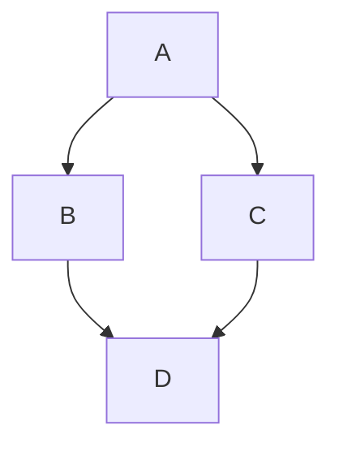
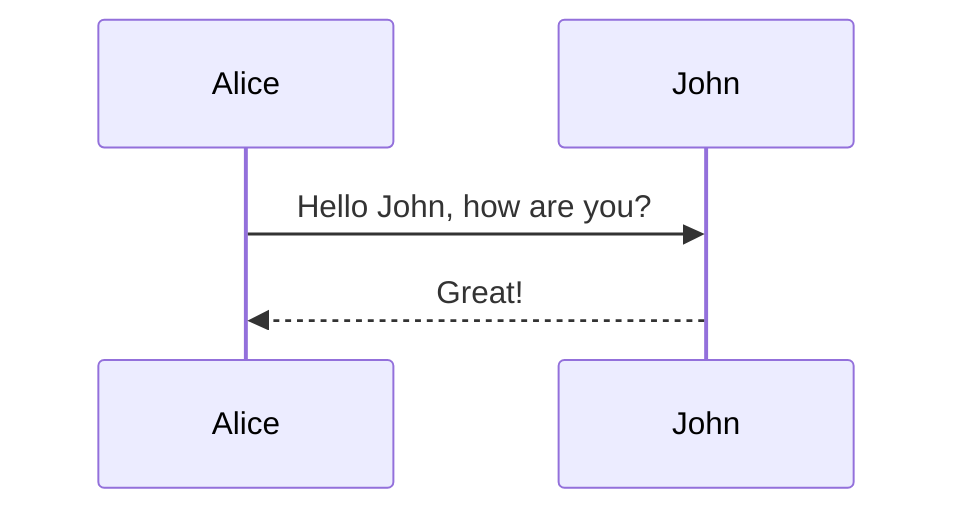
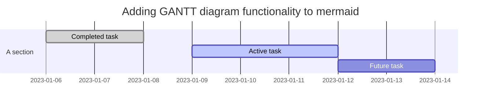
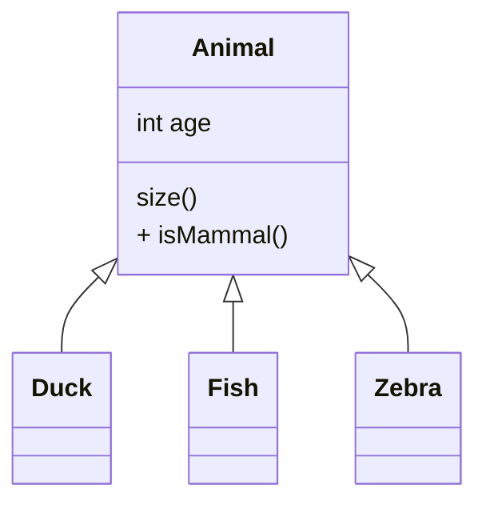
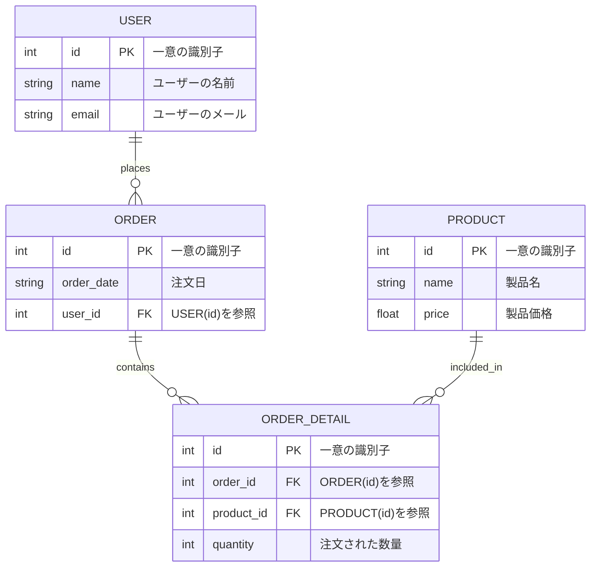

# Mermaid.js

Mermaid.jsはMarkdownファイル内でテキストベースの定義を使用してダイアグラムやフローチャートを作成するライブラリ。    
複雑なデータ構造やプロセスを視覚化するプロセスを単純化してくれる。  

- [Mermaid | Diagramming and charting tool](http://mermaid.js.org/)
- [図 - MkDocs の資料](https://squidfunk.github.io/mkdocs-material/reference/diagrams/)

フローチャート
----------------------------------------
   
```text
graph TD;
    A-->B;
    A-->C;
    B-->D;
    C-->D;
```



シーケンス図
----------------------------------------

```text
sequenceDiagram
    Alice->>John: Hello John, how are you?
    John-->>Alice: Great!
```



ガントチャート
----------------------------------------

```text
gantt
    dateFormat  YYYY-MM-DD
    title Adding GANTT diagram functionality to mermaid
    section A section
    Completed task            :done,    des1, 2014-01-06,2014-01-08
    Active task               :active,  des2, 2014-01-09, 3d
    Future task               :         des3, after des2, 5d
```



クラス図
----------------------------------------

```text
classDiagram
    Animal <|-- Duck
    Animal <|-- Fish
    Animal <|-- Zebra
    Animal : int age
    Animal : size()
    Animal :+ isMammal()
```




ER図
----------------------------------------

```text
erDiagram
    USER {
        int id PK "一意の識別子"
        string name "ユーザーの名前"
        string email "ユーザーのメール"
    }
    ORDER {
        int id PK "一意の識別子"
        string order_date "注文日"
        int user_id FK "USER(id)を参照"
    }
    PRODUCT {
        int id PK "一意の識別子"
        string name "製品名"
        float price "製品価格"
    }
    ORDER_DETAIL {
        int id PK "一意の識別子"
        int order_id FK "ORDER(id)を参照"
        int product_id FK "PRODUCT(id)を参照"
        int quantity "注文された数量"
    }
    
    USER ||--o{ ORDER : places
    ORDER ||--o{ ORDER_DETAIL : contains
    PRODUCT ||--o{ ORDER_DETAIL : included_in
```

