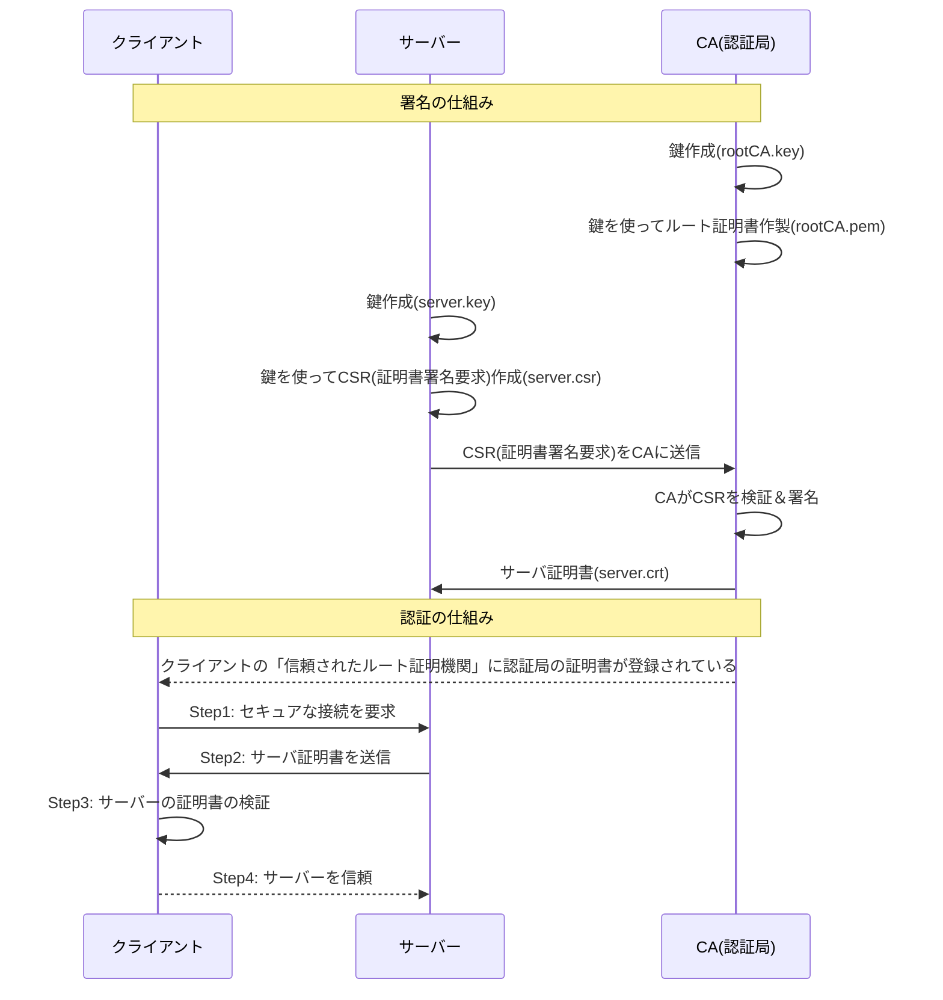
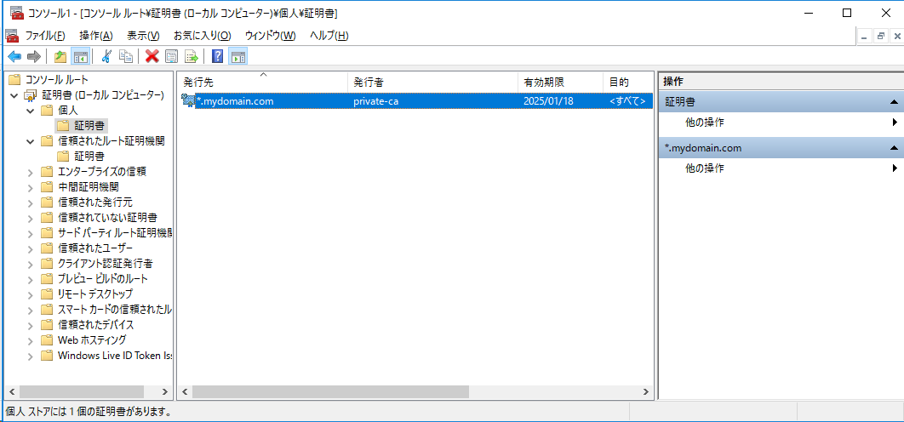
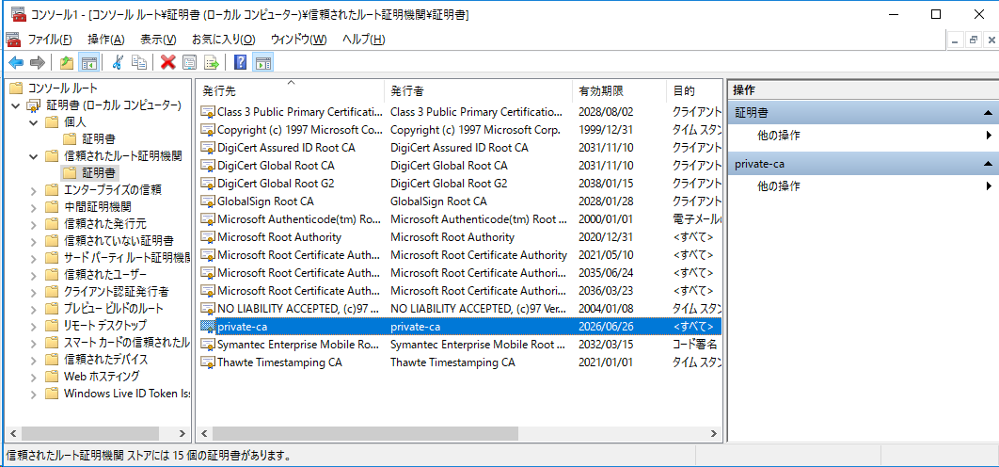
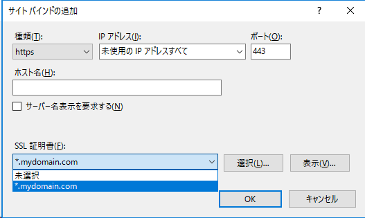
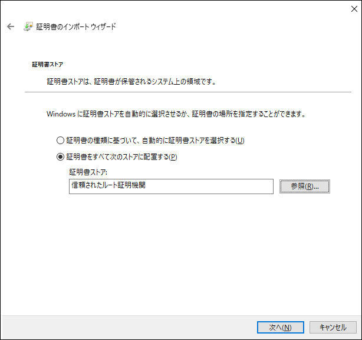
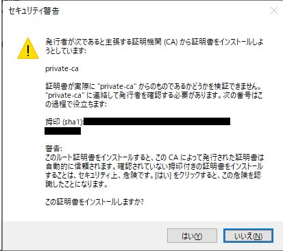
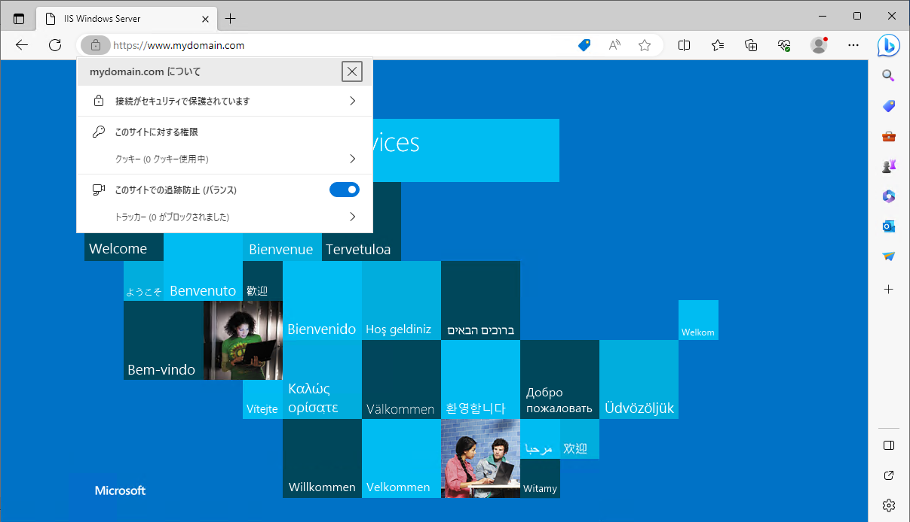

# プライベート認証局

openSSLで、プライベート認証局作製 + サーバ証明書作製をする手順。    
Chromeでのエラーを回避するため、SAN(subjectAltName)を含める。

Red Hat Enterprise Linux 8.1        
OpenSSL 1.1.1c FIPS  28 May 2019

## 概要



## CA(認証局)の準備

1. **ルートキーを生成**
    ```bash
    openssl genrsa -out rootCA.key 2048
    ```
    - `genrsa`: RSAキー生成コマンド。
    - `-out rootCA.key`: プライベートキーの出力ファイルを指定。
    - `2048`: キーのビット数。

2. **ルート証明書を作成し、自己署名する**
    ```bash
    openssl req -x509 -new -nodes -key rootCA.key -sha256 -days 1024 -out rootCA.pem
    ```
    - `req`: 証明書要求および証明書生成ユーティリティ。
    - `-x509`: 自己署名証明書を生成。
    - `-new`: 新しい要求を生成。
    - `-nodes`: No DES; 出力プライベートキーは暗号化されません。
    - `-key rootCA.key`: このプライベートキーを使用。
    - `-sha256`: ハッシュアルゴリズム。
    - `-days 1024`: 証明書が有効な日数。
    - `-out rootCA.pem`: 証明書の出力ファイル。

    実行例:
    ```text
    [user@redhat8 ~]$ openssl req -x509 -new -nodes -key rootCA.key -sha256 -days 1024 -out rootCA.pem
    You are about to be asked to enter information that will be incorporated
    into your certificate request.
    What you are about to enter is what is called a Distinguished Name or a DN.
    There are quite a few fields but you can leave some blank
    For some fields there will be a default value,
    If you enter '.', the field will be left blank.
    -----
    Country Name (2 letter code) [XX]:JP ★入力
    State or Province Name (full name) []:Tokyo ★入力
    Locality Name (eg, city) [Default City]:
    Organization Name (eg, company) [Default Company Ltd]:
    Organizational Unit Name (eg, section) []:
    Common Name (eg, your name or your server's hostname) []:private-ca ★入力
    Email Address []:
    ```

## CSR(証明書署名要求)作製

SAN(subjectAltName)は、CSRには含めないのが普通みたい(補足参照)

3. **サーバー鍵を生成**
    ```bash
    openssl genrsa -out server.key 2048
    ```
    - 引数はルートキー生成と同じです。

4. **サーバー鍵を使用してサーバーのCSRを生成**
    ```bash
    openssl req -new -key server.key -out server.csr
    ```
    - 引数`-new`, `-key`, および`-out`は上記と同様に機能します。サーバー鍵に基づいて新しいCSRを生成します。

    実行例:
    ```text
    [user@redhat8 ~]$ openssl req -new -key server.key -out server.csr
    You are about to be asked to enter information that will be incorporated
    into your certificate request.
    What you are about to enter is what is called a Distinguished Name or a DN.
    There are quite a few fields but you can leave some blank
    For some fields there will be a default value,
    If you enter '.', the field will be left blank.
    -----
    Country Name (2 letter code) [XX]:JP ★入力
    State or Province Name (full name) []:Tokyo ★入力
    Locality Name (eg, city) [Default City]:
    Organization Name (eg, company) [Default Company Ltd]:
    Organizational Unit Name (eg, section) []:
    Common Name (eg, your name or your server's hostname) []:*.mydomain.com ★入力
    Email Address []:

    Please enter the following 'extra' attributes
    to be sent with your certificate request
    A challenge password []:
    An optional company name []:
    ```

## CA(認証局)の署名

5. **SAN設定ファイルを作成**
    ```bash
    cat << '____EOF____' > san.cnf
    [ req ]
    distinguished_name = req_distinguished_name
    req_extensions = v3_req

    [ req_distinguished_name ]

    [ v3_req ]
    subjectAltName = @alt_names

    [ alt_names ]
    DNS.1 = *.mydomain.com
    ____EOF____
    ```
    - このファイルには、SANに関する設定が含まれています。

6. **サーバ証明書に署名**
    ```bash
    openssl x509 -req -in server.csr -CA rootCA.pem -CAkey rootCA.key -CAcreateserial -out server.crt -days 500 -sha256 -extfile san.cnf -extensions v3_req
    ```
    - `x509`: X.509証明書データの管理。
    - `-req`: 証明書要求を読む。
    - `-in server.csr`: 入力CSRファイル。
    - `-CA rootCA.pem`: CA証明書を指定。
    - `-CAkey rootCA.key`: CAキーを指定。


    確認 (特に`X509v3 Subject Alternative Name:` に指定したSANが含まれている事。)
    ```
    openssl x509 -in server.crt -text -noout
    ```

## 変換 (Windows向け)

### ルート証明書を.cer形式に

.pemのままだと、Windowsにインポートする際ダブルクリックで開けないので変換。     
(証明書ストアでの登録は可能みたい)

```bash
openssl x509 -inform PEM -outform DER -in rootCA.pem -out rootCA.cer
```

- `-inform PEM`: 入力形式としてPEMを指定。
- `-outform DER`: 出力形式としてDERを指定。
- `-in rootCA.pem`: 入力証明書ファイルを指定。
- `-out rootCA.cer`: 出力証明書ファイルを指定。

### サーバ証明書・秘密鍵を.pfxに

サーバ証明書（`server.crt`）とサーバの秘密鍵（`server.key`）を結合し、Windows Server上のIISで簡単にインストールできる形式(.pfx)に変更する。

```bash
openssl pkcs12 -export -out server.pfx -inkey server.key -in server.crt
```

- `-export`: 出力がPKCS#12ファイルになる。
- `-out server.pfx`: 出力する`.pfx`ファイルの名前を指定。
- `-inkey server.key`: サーバ証明書のための秘密鍵ファイルを指定。
- `-in server.crt`: サーバ証明書ファイルを指定。

コマンドを実行すると、パスワードを入力するように求められる。このパスワードは、`.pfx` ファイルをWindowsの証明書ストアにインポートする際に必要。


## サーバへの登録

### WindowsServer

以下をサーバに配置しておく。

- サーバ証明書(server.pfx)
- ルートCA証明書(rootCA.cer)

MMCから証明書(ローカルコンピュータ)を開いて...

サーバ証明書(server.pfx)は**個人**にインポート


ルートCA証明書(rootCA.cer)は**信頼されたルート証明機関**にインポート


インターネットインフォメーションサービス(IIS)マネージャーで、
任意のサイトにバインド設定



## クライアントへの登録

ルートCA証明書(rootCA.cer) を配置しておく。     
クライアントだから、まぁダブルクリック起動でもいいでしょう。


**信頼されたルート証明機関**を選択  


セキュリティ警告が出るが「はい」を選択      


当然だが、webサーバの名前解決ができる必要がある。    
今回は、www.mydomain.com を hostsに登録した。   

接続確認    



## 補足: CSRにSANを含めるか?

各社サイトの、opensslでのCSR作成手順を覗いてみたが、SANを含むような手順にはなっていない。    
このことから、普通は認証局側での署名時にSANの値を指定するように見受けられた。

[[CSR生成] Apache 2.x + mod_ssl + OpenSSL（新規・更新） | GMOグローバルサイン サポート](https://jp.globalsign.com/support/ssl/manual-csr/apache2.html)