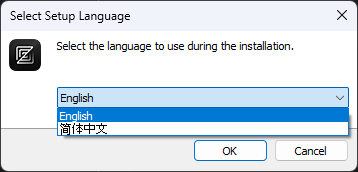
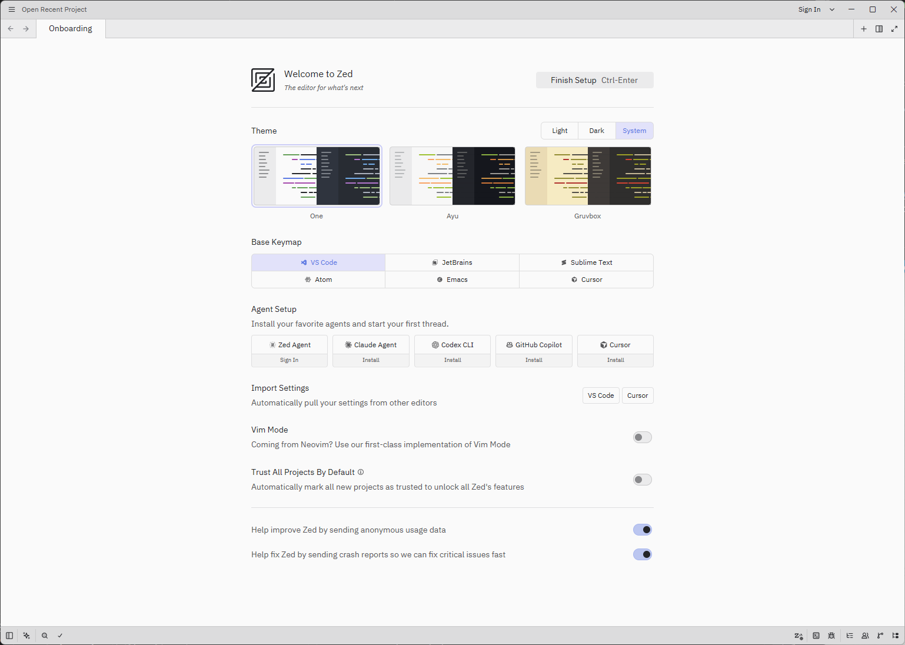
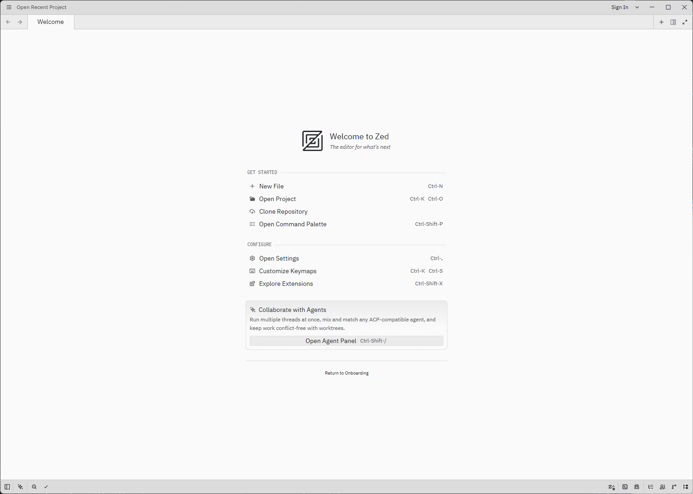
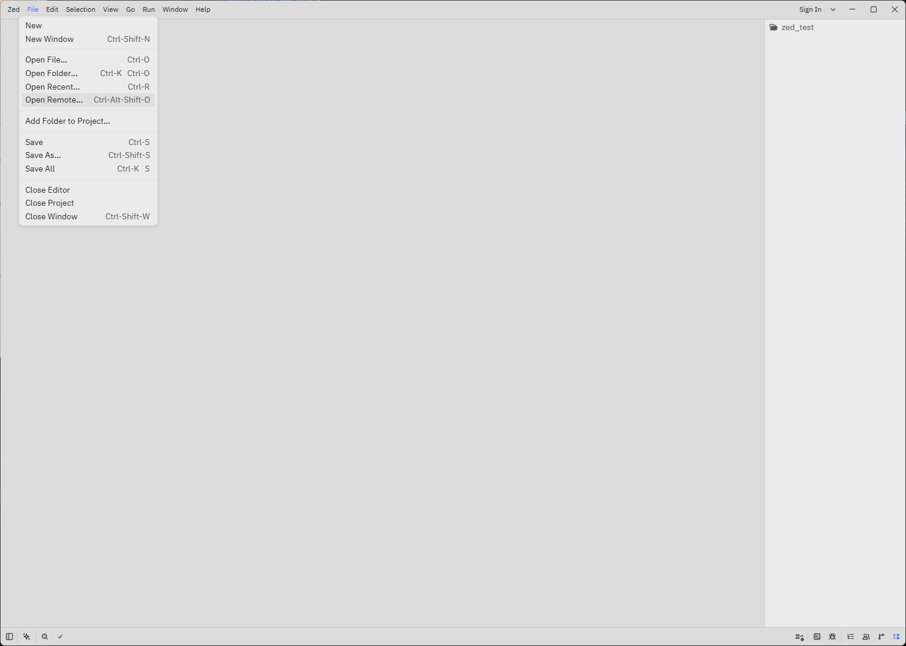
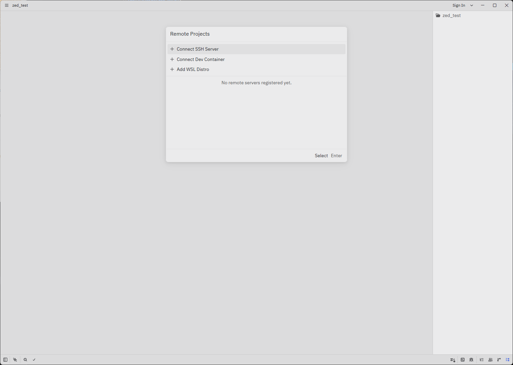

# Zed

[Zed — Your last next editor](https://zed.dev/)

VSCodeについて、  
使い始めた時は、軽量かつシンプルでなんて素晴らしいエディタなんだ、と思っていたのですが、  
なんか最近ごてごてしてて重たいし、ちょっとしんどくなっており移行先を探したい感じ。

Atomチームが作ったRust製で軽いと噂のZedが1.0となったので、試してみる。

## 初期設定

### インストール

日本語はない

キーマップにVSCodeがあってうれしい

## ツール系

### リモート接続(ssh)

Ctrl-Alt-Shift o
[File]->[Open Remote...]

